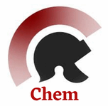
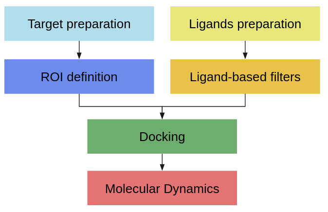

.. _docs-chem_introduction:

Welcome to Scipion Chem's documentation!
========================================
In the following documents, you will find all the necessary information for installing and using scipion-chem and all
the related plugins (called scipion-chem-\*). These plugins integrate mainly software for Virtual Drug Screening (VDS).
You can find the complete list in https://github.com/scipion-chem

Scipion Chem is itself built as a plugin of `Scipion <https://scipion-em.github.io/docs/release-3.0.0/index.html>`_, 
a workflow engine mainly used for Cryo-Electron Microscopy.
Therefore, most of its documentation also applies to Scipion-chem and you will need to install 
`Scipion3 <https://scipion-em.github.io/docs/release-3.0.0/docs/scipion-modes/how-to-install.html>`_ first
in order to use Scipion-chem.

Installation
========================================
Once Scipion is installed in your computer, you can install Scipion-chem as its plugin. Scipion-chem is the core for the
rest of scipion-chem-\* plugins, so you would need to install it first. To do so, you can check the instructions in the
`scipion-chem README <https://github.com/scipion-chem/scipion-chem/blob/master/README.rst>`_

Then, you are free to install any subsequent plugin you are interested in. The procedure is very similar, you will find
README files in each of the plugin repositories in case of doubt, appart from a more exhaustive documentation within this pages. 

  .. toctree::
    :maxdepth: 1
    :hidden:
    :caption: Plugins

    plugins/pwchem/index
    plugins/fpocket/index
    plugins/p2rank/index
    plugins/autodock/index
    plugins/lephar/index
    plugins/rosetta/index
    plugins/gromacs/index
    plugins/schrodinger/index
    plugins/modeller/index
    plugins/blast/index

Scipion-chem overview
========================================
In this section, each of the scipion-chem plugins will be briefly presented, grouped by their main functionalities.
We have mainly followed the workflow shown in the figure below, even though some included tools fall outside these
groups. Further documentation will be written for each of them, together with case studies and workflow examples.

1) **Scipion-chem**
---------------------
As stated before, Scipion-chem is the core of the scipion-chem plugins and it includes several tools which
are mainly oriented to virtual Drug Screening.

Scipion-chem automatically installs several util third-party software for the management and visualization of the
tasks in a typical bioinformatics and VDS workflow. These include:

    - **OpenBabel**: utils for small molecules
    - **RDKIT**: utils for small molecules
    - **MGLTools**: utils for small molecules, docking... (includes AutodockTools)
    - **JChemPaint**: Java program to manually draw small molecules
    - **Pymol**: installed as the main viewer of Scipion-chem
    - **PLIP**: Docking visualization in PyMol
    - **VMD**: installed as a secondary viewer and Molecular Dynamics trajectory viewer

Some of these programs are managed through conda environments in order to meet their requirements. This way,
Scipion-chem creates and uses 3 environments: rdkit-env, plip-env and vmd-env. These environments are used by the code
in the different plugins, and we strongly advise not to modify them manually in order to keep their functions.

The code inside this plugin also includes the python objects, viewers, wizards and other
utils for the rest of the scipion-chem plugins. We give these python objects special importance since the
interoperability of Scipion-chem relies on them.

Last but not least, Scipion-chem includes 3 groups of protocols: General, Sequences and VirtualDrugScreening. As their
names suggest, they contain Scipion protocols related to general or management tasks, protocols for the management of
sequences and finally those mainly used in a VDS workflow, including both structure and ligand based approaches.
Among them, we include consensus protocols for structural regions of interest (ROIs), which are usually predicted
protein pockets, and for docking results.
Further information about all these protocols can be found in the subsequent documentation.

2) Target and ligand preparation
----------------------------------------

The protocols for the protein (target) and the small molecule (ligand) preparation are actually included in other
plugins and do not hold any plugin by themselves. As you will be able to read below, protocols for receptor preparation
can be performed with autodock, rosetta or lephar plugins; while protocols for ligand preparation can be performed using
autodock, openbabel and rdkit (these last two included in Scipion-chem).

3) Structural Regions Of Interest (ROIs)
----------------------------------------

Usually, the VDS workflow from the target starts by defining onto the structure those regions where we are interested
in exploring the druggability. This is, defining those places where we would like to perform the docking.

We can address this task from multiple angles and Scipion-chem tries to offer a flexible environment to do so:

* | **Manually define structural ROIs**: If we have some prior knowledge about the receptor, we can just define these structural ROIs from the desired residues, coordinates or even previous ligands.
  | The user would be able to do so using the "Define Structural ROI" protocol in Scipion-chem.
* | **Map structural from sequence ROIs**: The user would also be able to map some ROI from the protein sequence to its structure using the "Map sequence ROIs" protocol in Scipion-chem.
  | For example, one might be interested in mapping conserved regions of the sequence onto the structure
* | **Predict binding pocket sites**: Typically, ligand bind to protein pockets or cavities.
  | We included several plugins including programs which predict the most promising pockets in the protein structure, based on variable factors. These are shown below.

3.1) **scipion-chem-fpocket**
~~~~~~~~~~~~~~~~~~~~~~~~~~~~~

`FPocket <https://github.com/Discngine/fpocket>`_ is one of the most widely known programs for protein pocket detection.
In this plugin we include the main tool for pocket prediction, FPocket, together with the tool for predicting pockets
over a Molecular Dynamics simulation, MDPocket (in devel).

3.2) **scipion-chem-p2rank**
~~~~~~~~~~~~~~~~~~~~~~~~~~~~~

`P2Rank <https://github.com/rdk/p2rank>`_ is a ligand binding site predictor based on machine learning. In this plugin
we include its main functionality for protein pocket prediction.

4) Ligand based approaches
----------------------------------------

This section is mainly included in the Scipion-chem core, and mainly consists on several rdkit functionalities that
characterize small molecules which would later be used for docking. They are inspired on some of the
`TechOpenCADD talktorials <https://projects.volkamerlab.org/teachopencadd/>`_

We included filters based on ADME or PAINS qualities; based on shape or fingerprint distance against a target ligand;
and finally tools for generating, managing and filtering by pharmacophores.

5) Docking
----------------------------------------

5.1) **scipion-chem-autodock**
~~~~~~~~~~~~~~~~~~~~~~~~~~~~~~

One of the main plugins in the Scipion-chem framework is the one for AutoDock. Here, we include the main docking
functionalities of AutoDock4 and Vina, together with AutoLigand for protein pocket prediction and two protocols for
the preparation of the receptor and the ligands (`Meeko <https://github.com/forlilab/Meeko>`_).
At the moment of this writing, we have just included the
`AutoDockGPU <https://github.com/ccsb-scripps/AutoDock-GPU>`_ and the
`Vina-1.2 <https://github.com/ccsb-scripps/AutoDock-Vina>`_ versions from the ForliLab (https://forlilab.org/)

Scipion-chem-autodock automatically manages the necessary pdbqt format files and interconverts them from and to other
file formats when necessary using openbabel or AutoDockTools when necessary. This way, the interoperability with other
VDS tools can be achieved.

5.2) **scipion-chem-lephar**
~~~~~~~~~~~~~~~~~~~~~~~~~~~~

With this plugin from `Lephar <http://www.lephar.com/software.htm>`_, we include yet another tool for docking, LeDock.
Together with the main docking tool, we include another protocol for target preparation using LePro.

5.3) **scipion-chem-rosetta**
~~~~~~~~~~~~~~~~~~~~~~~~~~~~~

`Rosetta <https://www.rosettacommons.org/>`_ is widely known as one of the main software for molecular modelling.
Even though this offers a lot of useful functionalities, as for today only protocols related to DARC docking are
integrated. This includes a protocol for the target preparation and the protocol for `DARC docking
<https://www.rosettacommons.org/docs/latest/application_documentation/docking/DARC>`_
Regarding EM and protein modelling, this plugin also includes a protocol to fit a protein reference structure into an
electron density map.

As for the rest of the plugins, the Scipion team is open to hear any suggestion or accept any help for integrating
new functionalities, so let us know if you have any.

Also, user must know that the installation of Rosetta is not automatic. Instruction for a proper installation can be
found in the `scipion-chem-rosetta <https://github.com/scipion-chem/scipion-chem-rosetta>`_ repo.

6) **Molecular Dynamics**
----------------------------------------

Molecular Dynamics (MD) simulate the state and movement of some molecules through time by modelling the energy
interactions of their atoms and calculating the coordinates and velocities of each of them during a fixed number of
steps. This modelling is never straight forward, and there are many parameters that must be tuned, but if it's done
properly one might get an accurate enough representation of the molecule in the real environment.

In Scipion-chem, we have included several programs that perform MD to model and simulate atomic
structures (usually proteins) and even protein-ligand complexes.

In the VDS context, once you have some promising molecules docked to your receptor, one might want to do further
computational studies to check whether the predicted interaction will be maintained in time or not.
This can be achieved using molecular dynamics on the receptor-ligand complex.

6.1) **scipion-chem-amber**
~~~~~~~~~~~~~~~~~~~~~~~~~~~~

`Amber <https://ambermd.org/>`_ is a suite of biomolecular simulation programs. It contains open software for preparing
and running MD simulations (AmberTools) and a second part which requires a license (Amber).
By the time this documentation is writen, only AmberTools is integrated in Scipion-chem, so it can be installed
automatically.

AmberTools also include cpptraj, a tool for managing and analyzing the resulting MD trajectories and is also
being integrated in Scipion-chem-amber.

6.2) **scipion-chem-gromacs**
~~~~~~~~~~~~~~~~~~~~~~~~~~~~~

`Gromacs <https://www.gromacs.org/>`_ A free and open-source software suite for high-performance MD and
output analysis.
By the time this documentation is writen, only the functionality for protein simulations is integrated. The
parametrization of small molecules for simulating complexes will be handled and incorporated soon.

Different Gromacs tools are also included to manage and analyze the resulting trajectories.

6.3) **scipion-chem-schrodingerScipion**
~~~~~~~~~~~~~~~~~~~~~~~~~~~~~~~~~~~~~~~~

`Schrodinger <https://www.schrodinger.com/>`_ is a full platform itself devoted to drug discovery and materials design.
From Scipion-chem, we have integrated some of its tools and adapted them to or workflow, managing their maestro format
files. Among the utils integrated, we have receptor (prepwizard) and ligand preparation (LigPrep),
binding pocket prediction (SiteMap), docking (Glide) and molecular dynamics (Desmond).

This way, the user can design a full workflow of VDS using Schrodinger from the Scipion framework and analyze its
results from the incorporated viewers.

Finally, user must know that the installation of Schrodinger is not automatic, since it depends on a license.
Instruction for a proper installation can be found in the
`scipion-chem-schrodingerScipion <https://github.com/scipion-chem/scipion-chem-schrodingerScipion>`_ repo.

7) **Others**
----------------------------------------

Further functionalities outside the most common VDS workflow are included in Scipion-chem. They include:

7.1) **scipion-chem-modeller**
~~~~~~~~~~~~~~~~~~~~~~~~~~~~~~~~~~~~~~~~

`Modeller <https://salilab.org/modeller/>`_ is a tool used for protein homology modelling. In this plugin,
we include a protocol for performing the typical `homology modelling <https://salilab.org/modeller/manual/node15.html>`_
based on the sequence alignment of reference structures; and a protocol for `modelling the structural change of
mutations <https://salilab.org/modeller/wiki/Mutate_model>`_ in the protein sequence.

7.2) **scipion-chem-blast**
~~~~~~~~~~~~~~~~~~~~~~~~~~~~~~

`Blast <https://blast.ncbi.nlm.nih.gov/Blast.cgi>`_ is the NCBI widely known program for searching biological
sequences.
In this plugin, we include tools for managing and configuring blast searchs, creating local BLAST databases and
easily downloading NCBI data (protein/nucleotide sequences or small molecules) from their IDs

Get in contact
==================
From the Scipion Chem team we would be happy to hear your doubts and suggestions, do not hesitate to contact us at any
time. To do so, you can either open an issue in the Github repository related to your question or
contact us by mail.

If the question is related to the Scipion framework, try the `contact us <https://scipion.i2pc.es/contact>`_ page.
If it is related to some scipion-chem plugin or functionality, you can send a mail to
the developer at `ddelhoyo@cnb.csic.es <mailto:ddelhoyo@cnb.csic.es>`_.
