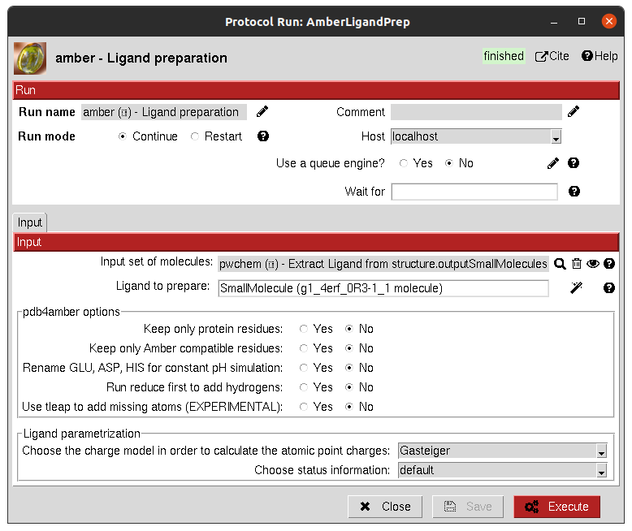

:orphan: true

.. _amber-ligand-parametrization:

###############################################################
Amber Ligand Parametrization
###############################################################
This protocol parametrizes and prepares a ligand to be used in Amber simulations using pdb4amber and Antechamber. 
Additional modifications, handled by Scipion-chem, might be addressed so Amber is able to read the input structure.

Input
----------------------------------------
.. include:: ../../../templates/plugins/input-help.rst

|

The result of this protocol is a ``AmberSystem``, containing the parametrized ligand.
