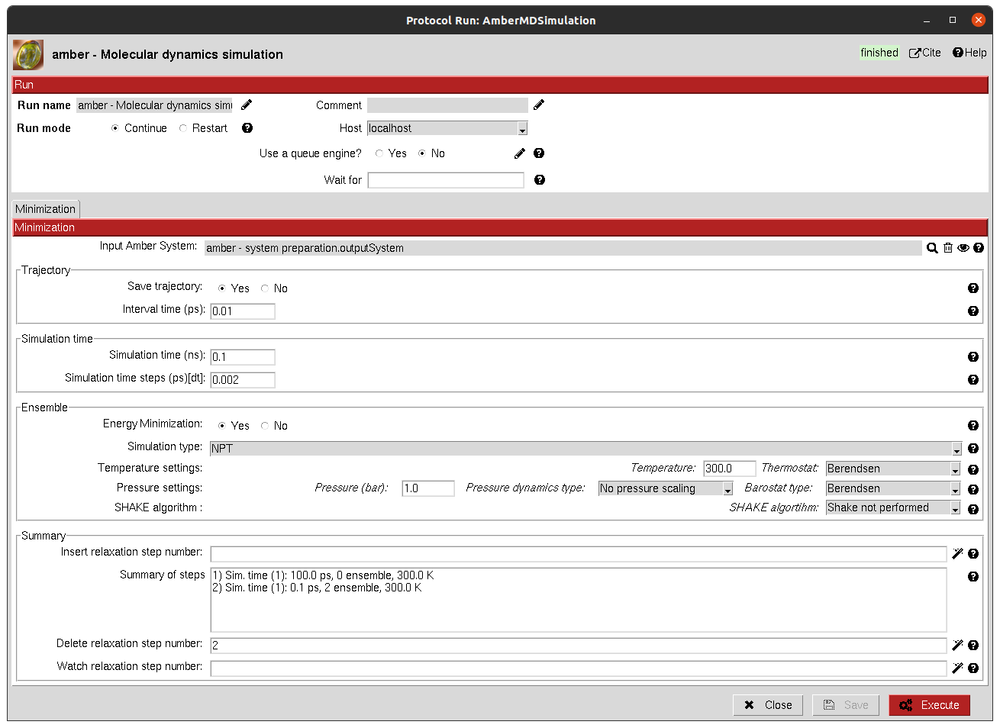

:orphan: true

.. _amber-md-simulation:

###############################################################
Amber Molecular Dynamics (MD) Simulation
###############################################################
This protocol  defines and executes a Amber MD simulation.

|

The result of this protocol is a ``AmberSystem``, containing the prepared system together with the generated trajectory.
