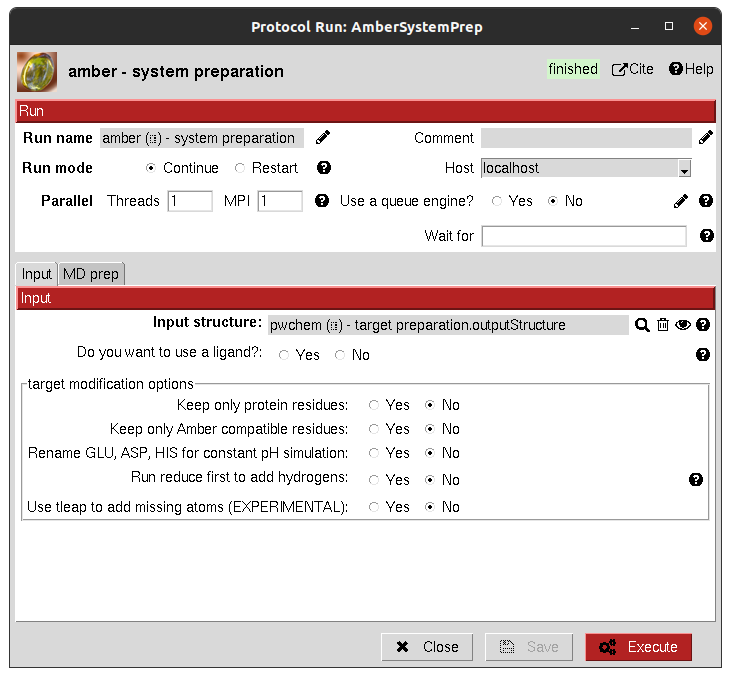

:orphan: true

.. _amber-system_preparation:

###############################################################
Amber System Preparation
###############################################################
This protocol prepares a system for Amber MD simulation, cleaning the input PDB for further analysis and generating topology and coordinate files necessary.

|

|

The result of this protocol is a ``AmberSystem``, containing the prepared system.

| 
