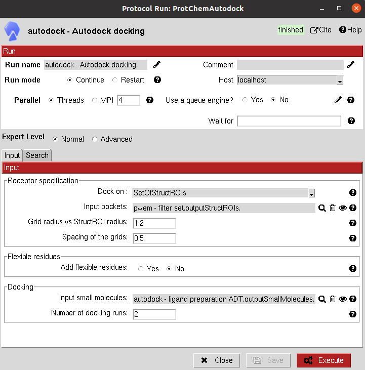
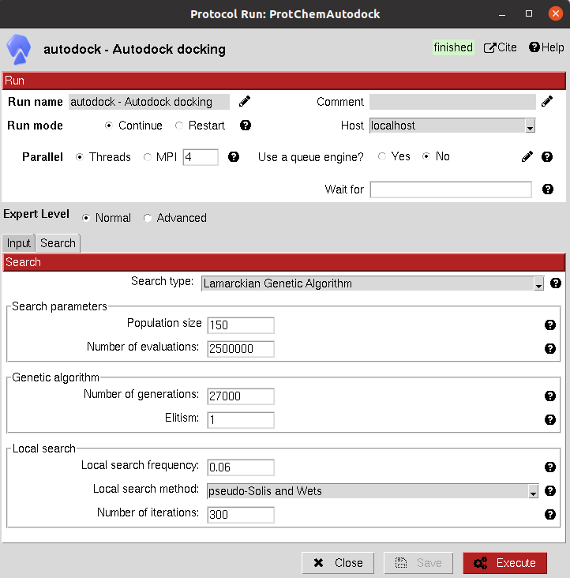

:orphan: true

.. _autodock-autodock4_docking:

###############################################################
AutoDock4 Docking
###############################################################
This protocol uses `AutoDock4: <https://autodock.scripps.edu/download-autodock4/>`_ tool to predict the binding poses for a set of small molecules over the receptor. 
The search parameters can be modified to make a full use of the AutoDock4 options.
The input can either be an ``AtomStruct`` (to perform the docking on the whole protein) or a ``SetOfStructROIs`` (to perform the docking only on the Structural Regions Of Interest).

|

|form4_1| |form4_11|

|

The results of these protocols are a ``SetOfSmallMolecules``, containing the predicted binding poses for the input molecules. 
The user can visualize them using **Analyze Results**, which will display the General SmallMolecules viewer.

A section for defining flexible receptor residues is included in these docking protocols.

|

.. |testCommand| replace:: autodock.tests.test_autodock.TestAutoDock
.. include:: ../../../templates/plugins/protocol-test.rst