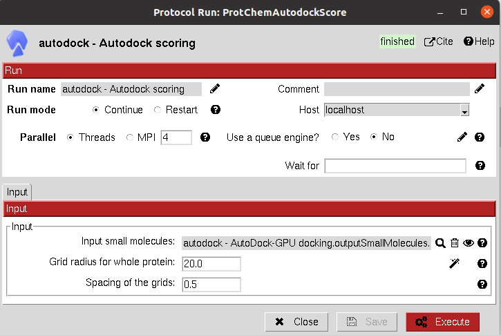

:orphan: true

.. _autodock-autodock4-dock-scoring:

###############################################################
AutoDock4 Dock Rescoring
###############################################################
This protocol scores a ``SetOfSmallMolecules`` that has been already docked by any docking program using `AutoDock4: <https://autodock.scripps.edu/download-autodock4/>`_ scoring function. 

The necessary grid is built over the whole protein and the molecules are rescored.

|

The result of this protocol is a ``SetOfSmallMolecules``, containing the rescored small molecules still docked in the same position.

.. |testCommand| replace:: autodock.tests.test_autodock.TestAutoDockScoring
.. include:: ../../../templates/plugins/protocol-test.rst
