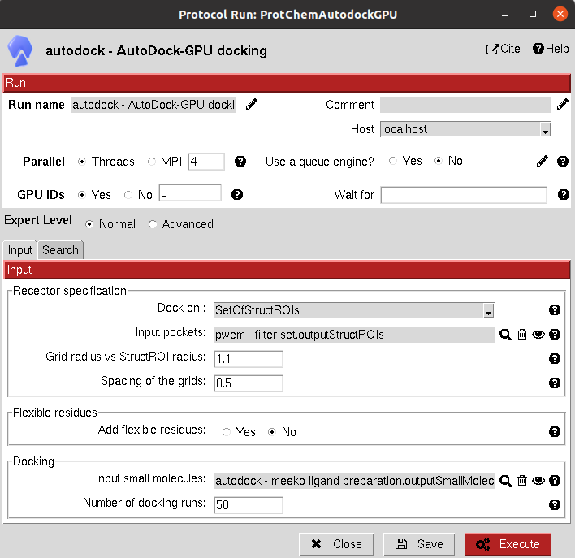

:orphan: true

.. _autodock-autodockGPU-docking:

###############################################################
AutoDock-GPU Docking
###############################################################
This protocol uses `AutoDock-GPU: <https://github.com/ccsb-scripps/AutoDock-GPU>`_, the GPU implementation of AutoDock, which is several times faster and includes many bug fixes and new features. 

It includes different parameters than AutoDock4, so it has been moved to a new protocol.

The input can either be an ``AtomStruct`` (to perform the docking on the whole protein) or a ``SetOfStructROIs`` (to perform the docking only on the Structural Regions Of Interest).

|

|

The results of these protocols are a ``SetOfSmallMolecules``, containing the predicted binding poses for the input molecules.

The user can visualize them using **Analyze Results**, which will display the General SmallMolecules viewer.

A section for defining flexible receptor residues is included in these docking protocols.

.. |testCommand| replace:: autodock.tests.test_autodock.TestAutoDockGPU
.. include:: ../../../templates/plugins/protocol-test.rst
