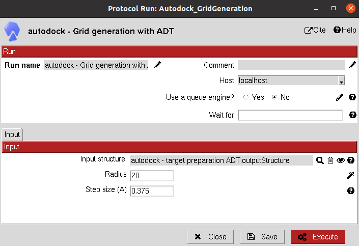

:orphan: true

.. _autodock-grid-generation:

###############################################################
Grid generation
###############################################################
This protocol generates the grids used by the different AutoDock programs using autogrid4.

The protocol is currently deprecated since all the necessary grids are internally generated by the protocols described below.

It might just be useful to generate and then check the resulting grids.

Input
----------------------------------------
.. include:: ../../../templates/plugins/input-help.rst

|

.. |testCommand| replace:: autodock.tests.test_autodock.TestGridADT
.. include:: ../../../templates/plugins/protocol-test.rst
