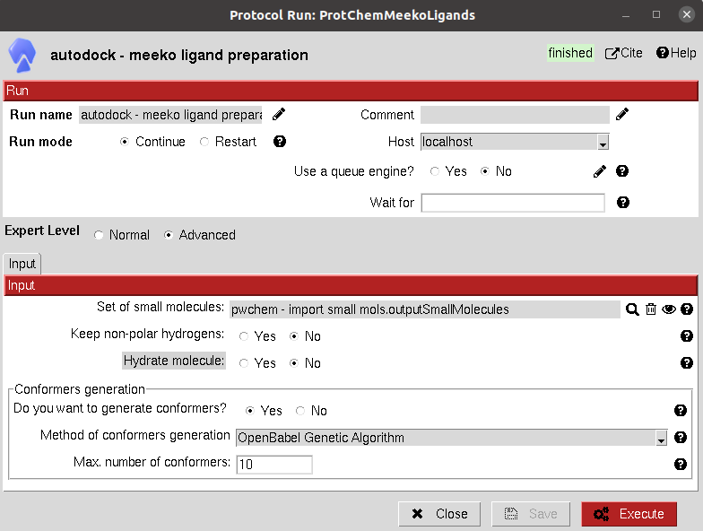

:orphan: true

.. _autodock-ligand-preparation-meeko:

###############################################################
Ligand preparation Meeko
###############################################################
This protocol uses the new `Meeko <https://github.com/forlilab/Meeko>`_ functionality as a Python module to prepare a ``SetOfSmallMolecules``.

These are prepared by adding hydrogens, fixing bonds and calculating partial charges.

The option for conformer generation is also available, however, in the case of AutoDock docking programs, this step can be skipped since the ligands are treated as flexible on their rotable bonds.

Input
----------------------------------------
.. include:: ../../../templates/plugins/input-help.rst

|

The result of this protocol is a ``SetOfSmallMolecules``, containing the prepared ligands.

.. |testCommand| replace:: autodock.tests.test_autodock.TestADMeekoLigands
.. include:: ../../../templates/plugins/protocol-test.rst
