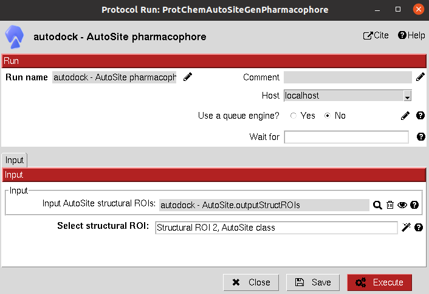

:orphan: true

.. _autodock-pharmacophore-generation:

###############################################################
AutoSite Pharmacophore Generation
###############################################################
This protocol generates a ``Pharmacophore`` object RDKit compatible from a resulting binding site of AutoSite. 

This pharmacophore objects can later be modified or used to filter compatible molecules using pharmacophore Scipion Chem protocols.

Input
----------------------------------------
.. include:: ../../../templates/plugins/input-help.rst

|

The result of this protocol is a ``Pharmacophore`` object containing the hydrophobic, H-donor and H-acceptor cluster centers described in the AutoSite output.

.. |testCommand| replace:: autodock.tests.test_autodock.TestAutoSitePharmacophore
.. include:: ../../../templates/plugins/protocol-test.rst