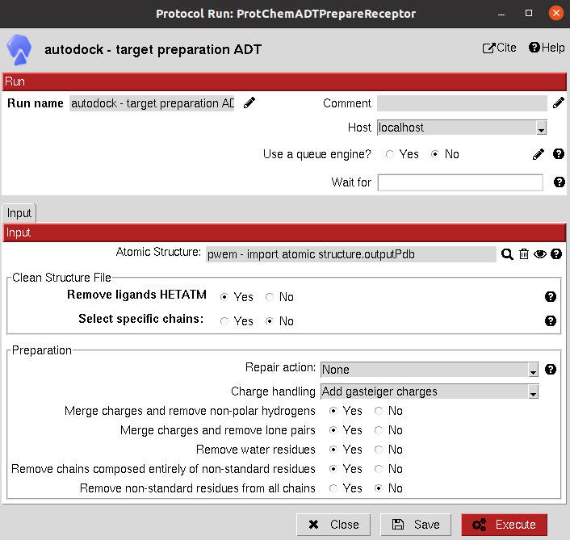

:orphan: true
.. _autodock-receptor-preparation:

###############################################################
Receptor preparation
###############################################################
This protocol prepares an ``AtomStruct`` object containing a protein file to make it ready for 
`AutoDock tools <https://autodocksuite.scripps.edu/adt/>`_, such as docking with AutoDock or Vina. 
Several options for managing non-standard residues, repairing hydrogens and bonds and estimating partial 
charges are included. It uses the script ``prepare_receptor4.py`` in the utilities of AutoDock Tools.

From `scipion-chem <../../pwchem/index>`_, we also provide the option of cleaning the structure from 
HETATM atoms and selecting specific chains from the input structure.

Input
----------------------------------------
.. include:: ../../../templates/plugins/input-help.rst

|

The result of this protocol is an ``AtomStruct`` object containing the resulting pdbqt file of the receptor, ready for
other AutoDock tools.

.. |testCommand| replace:: autodock.tests.test_autodock.TestADPrepareReceptor
.. include:: ../../../templates/plugins/protocol-test.rst
