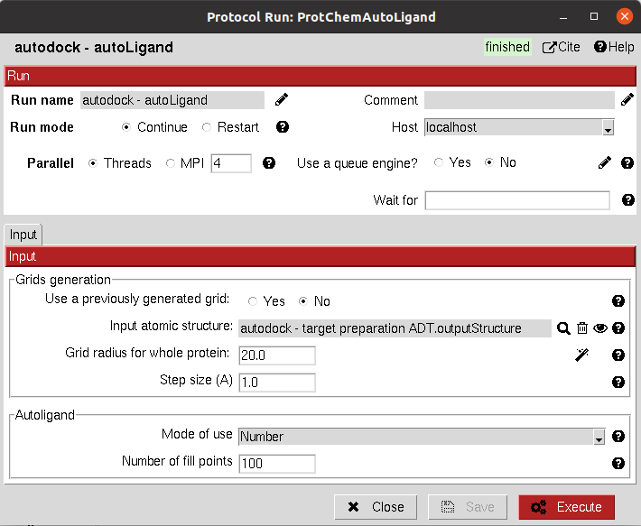

:orphan: true

.. _autodock-roi_autoligand:

###############################################################
AutoLigand Binding Site prediction
###############################################################
This protocol uses `AutoLigand <https://autodock.scripps.edu/resources/autoligand/>`_ tool to predict the binding sites on a protein receptor.
The user must be aware that this method is deprecated and will soon be deleted so they should use AutoSite instead.

|

|

The results of these protocols are a ``SetOfStructROIs`` (Structural Regions Of Interest), containing the predicted binding sites. 
The user can visualize them using **Analyze Results**, which will display the General StructROIs viewer.

|

.. |testCommand| replace:: autodock.tests.test_autodock.TestAutoLigand
.. include:: ../../../templates/plugins/protocol-test.rst