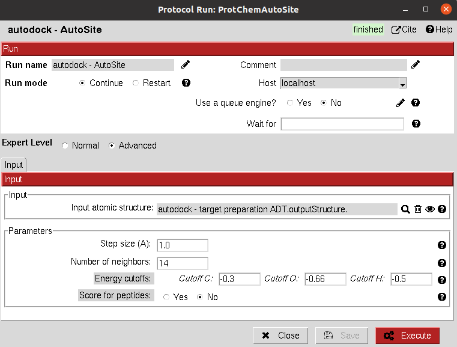

:orphan: true

.. _autodock-roi_autosite:

###############################################################
AutoSite Binding Site prediction
###############################################################
This protocol uses `AutoSite <https://www.ncbi.nlm.nih.gov/pmc/articles/PMC5048065/>`_ tool to predict the binding sites on a protein receptor.

|

|

The results of these protocols are a ``SetOfStructROIs`` (Structural Regions Of Interest), containing the predicted binding sites. 
The user can visualize them using **Analyze Results**, which will display the General StructROIs viewer.

|

.. |testCommand| replace:: autodock.tests.test_autodock.TestAutoSite
.. include:: ../../../templates/plugins/protocol-test.rst