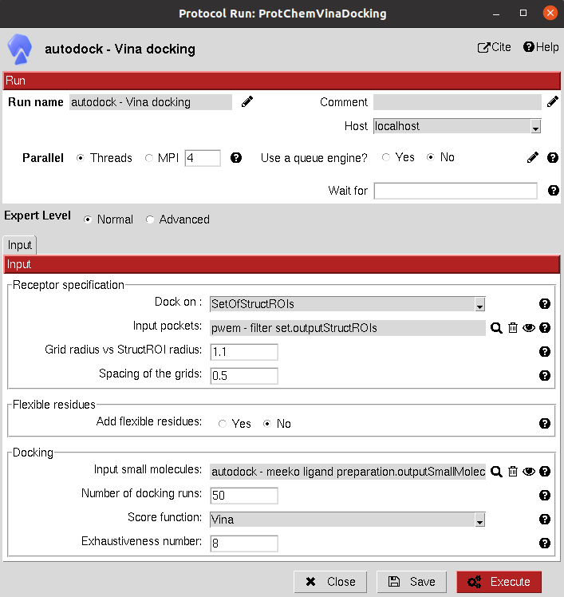

:orphan: true

.. _autodock-vina-docking:

###############################################################
Vina Docking
###############################################################
This protocol uses `AutoDock Vina: <https://vina.scripps.edu/>`_ docking engine to predict the binding poses for a set of small molecules over the receptor. 
Currently, `Vina 1.2 <https://github.com/ccsb-scripps/AutoDock-Vina>`_ is included.
The input can either be an ``AtomStruct`` (to perform the docking on the whole protein) or a ``SetOfStructROIs`` (to perform the docking only on the Structural Regions Of Interest).

Input
----------------------------------------
.. include:: ../../../templates/plugins/input-help.rst

   
|

The results of these protocols are a ``SetOfSmallMolecules``, containing the predicted binding poses for the input molecules. 
The user can visualize them using **Analyze Results**, which will display the General SmallMolecules viewer.

A section for defining flexible receptor residues is included in these docking protocols.

.. |testCommand| replace:: autodock.tests.test_autodock.TestVina
.. include:: ../../../templates/plugins/protocol-test.rst