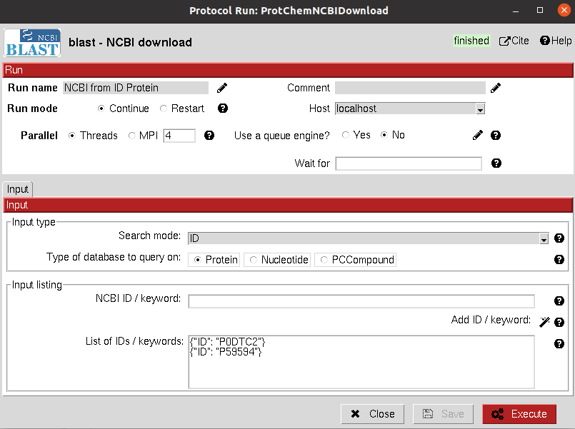

:orphan: true

.. _blast-NCBI-download:

###############################################################
Blast NCBI download
###############################################################
This protocol access the NCBI API using the `Entrez module <https://biopython.org/docs/1.75/api/Bio.Entrez.html>`_
of the Biopython package. The protocol is prepared to fetch protein or nucleotide sequences from the NCBI databases and
small molecules from PubChem.

The user can perform a search using NCBI IDs, where the specific objects they refer will be directly fetched; or
a broader search using keywords which will return a set of objects which are returned by the esearch functionality.
The user must be aware of this functionality, since the outputs might not be those expected.

Input
----------------------------------------
.. include:: ../../../templates/plugins/input-help.rst

|

The result of this protocol is either a ``SetOfSequences`` (for protein or nucletides sequences) or a ``SetOfSmallMolecules``
for PubChem downloads.

.. |testCommand| replace:: blast.tests.test_blast.TestNCBIDownload
.. include:: ../../../templates/plugins/protocol-test.rst
