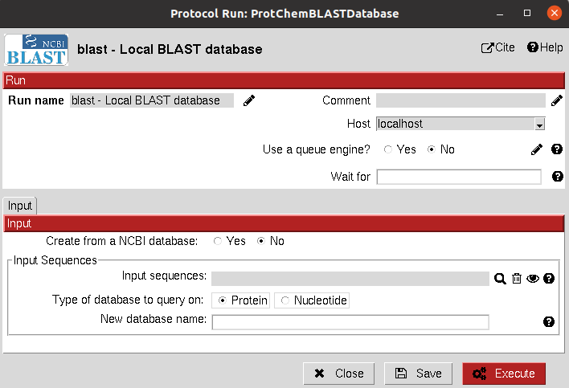

:orphan: true

.. _blast-create_database:

###############################################################
Create local database
###############################################################
This protocol creates a local database in BLAST format and stores it in the plugin folder. The user can create
databases either from a SetOfSequences or from default databases in BLAST. The user must be aware of this last option,
since most of the BLAST databases are quite big and downloading them will expend high amounts of time and storage.

|

|

This protocol does not output any object, but it saves the database in the plugin folder.

.. |testCommand| replace:: blast.tests.test_blast.TestDatabaseBLAST
.. include:: ../../../templates/plugins/protocol-test.rst

| 

