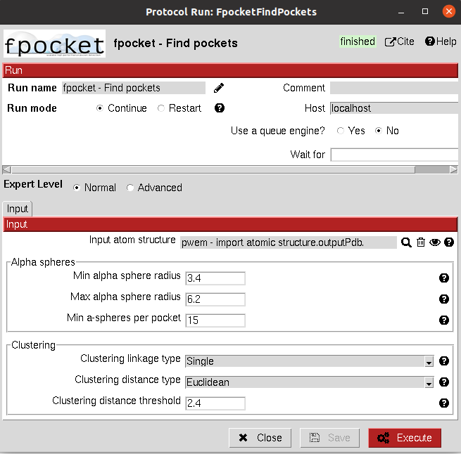

:orphan: true

.. _fpocket-fpocket-prediction:

###############################################################
FPocket pocket detection
###############################################################
The main program of the `FPocket <https://github.com/Discngine/fpocket>`_  package is fpocket and it is integrated in Scipion-chem-fpocket as a protocol.

|

.. figure:: ../../../../_static/images/plugins/fpocket/fpocket_protocol.png
   :alt: fpocket protocol
   :align: center

|

This protocol takes a ``AtomStruct`` as an input and predicts its pockets based on its concavities (based on alpha-spheres) and electrostatics. 
The parameters in the form control the alpha-spheres creation and their posterior clustering.

You can check the meaning of these parameters in the help button for each of them, and if you need more information
we recommend you to check the `FPocket documentation <https://github.com/Discngine/fpocket/blob/master/doc/MANUAL.md>`_.

|

|

The result of this protocol is a ``SetOfStructROIs`` object, containing the predicted pockets. You can inspect this pockets
using the **Analyze results** button or if you want to directly see the related files you will be able to find them
in the protocol's folder.

.. |testCommand| replace:: fpocket.tests.test_fpocket.TestFPocket
.. include:: ../../../../templates/plugins/protocol-test.rst

| 

Scipion-chem-fpocket viewer
================================
The viewer for fpocket results include the Pymol General Viewer for ``SetOfStructROIs`` objects plus an specific viewer of
the alpha-spheres over the protein structure using VMD.

|

|viewer|  |vmd|

|

.. |viewer| image:: ../../../../_static/images/plugins/fpocket/fpocket_viewer.png
   :alt: fpocket viewer
   :width: 50%

As for the rest of the Scipion object, you can also check **Table view** to visualize the stored parameters for each of
the items in the set.

|