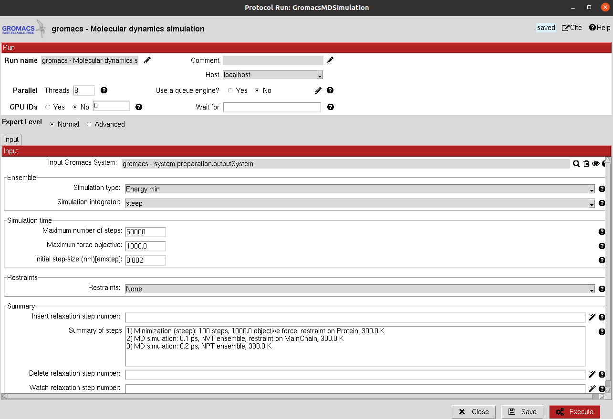
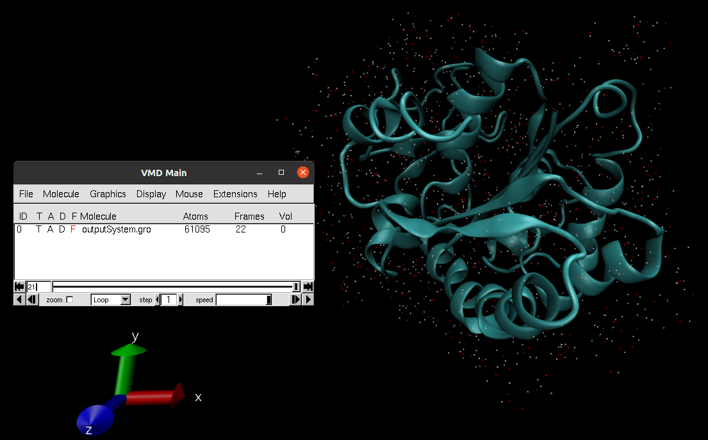
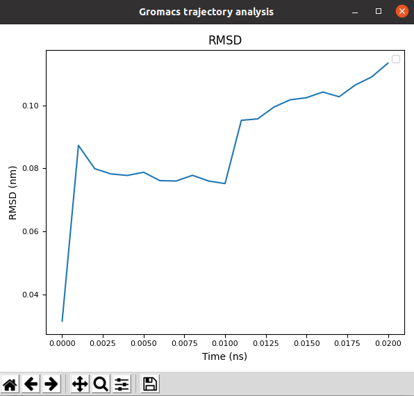

.. _docs-chem-gromacs:

.. figure:: ../../images/gromacs/gromacs_logo.png
   :alt: gromacs logo

###############################################################
Welcome to Scipion-chem-gromacs's documentation!
###############################################################
In order to use this plugin, you need to install first Scipion-chem.
`Scipion-chem <https://github.com/scipion-chem/docs>`_
is the core for the rest of scipion-chem-\* plugins. To do so, you can check the instructions in the
`Scipion-chem README <https://github.com/scipion-chem/scipion-chem/blob/master/README.rst>`_.

Similarly, you can find the installation instructions of this plugin in
`Scipion-chem-gromacs README <https://github.com/scipion-chem/scipion-chem-gromacs/blob/master/README.rst>`_

|

Scipion-chem-gromacs overview
******************************************
`Gromacs <https://www.gromacs.org/>`_ is a free and open-source software suite for high-performance Molecular
Dynamics (MD) and output analysis. In Scipion-chem-gromacs, we have integrated tools for preparing MD systems,
running simulations and modifying and analyzing the output trajectories.

Scipion-chem-gromacs protocols
******************************************

**System preparation**
================================
This protocol prepares a Gromacs MD system prior to its simulation from a AtomStruct object. This protein must have
all the atoms including hydrogens, we recommend you to prepare it first with any of our integrated protocols
for receptor preparation.

It allows the user to create a solute boundary box, define the force field and finally specify the ions in the solute,
which can be set to neutralize the charges, or manually add the desired number.

Unfortunately, as for today we do not include the functionality for preparing complexes containing non-protein atoms,
such as ligands. Hopefully it will be coming soon.

All parameters include a help button that gives further information for each of them.

|

|form1| |form1_2|

.. |form1| image:: ../../images/gromacs/gromacs_form1.png
   :alt: gromacs form1
   :width: 45%

.. |form1_2| image:: ../../images/gromacs/gromacs_form1_2.png
   :alt: gromacs form1_2
   :width: 50%

|

The result of this protocol is a GromacsSystem, containing the Gromacs coordinates and topology files. The user
can visualize the complex with PyMol using **Analyze Results**.

|

.. figure:: ../../images/gromacs/gromacs_out_1.png
   :alt: gromacs out1

|

A test for this protocol can be run using::
    scipion3 tests gromacs.tests.tests.TestGromacsPrepareSystem

|

**Run MD simulation**
================================
This protocol takes the prepared Gromacs system and use it to run a defined simulation. In the form, the user can
define different simulation stages that the protocol will run sequentially. The parameters of this protocol are grouped
as:

1) **Input**: The GromacsSystem product of the system preparation described above.

Then, the user can define the different MD stages:

2) **Ensemble**: Defines the type of simulation in the current stage. The user can choose from energy minimization, NVT or NPT. Then, for each of them other parameters will appear to further tune the simulation.

3) **Simulation time**: Defines the length of the simulation in number of steps for the minimization and in time for NVT and NPT. In the case of NVT and NPT, the user can also specify whether the trajectory from the stage should be saved.

4) **Restraints**: Energetic restraints can be defined during the stage for the principal groups of atoms present in the system (Protein, Backbone, C-alpha...)

Then, the defined stage can be inserted into the workflow, whose summary is shown below.

5) **Summary**: A summary of the added stages is shown. However, this list is just a summary and manual modifications will not yield changes. In order to modify the stages, the user need to use the wizards in order to add, delete or watch the parameters of the desired stages, which can be specified in the wizard text input.

|

|

The result of this protocol is a GromacsSystem, this time also containing the concatenated trajectory of the
last saved stages (If stages 2, 4 and 5 were saved, since we should not concatenate 2 to 4, only 4 and 5 will be saved).
Using **Analyze Results**, a form with different visualization options will be displayed, where the user can:

|

.. figure:: ../../images/gromacs/gromacs_out2_1.png
   :alt: gromacs out2_1

|

1) **Open Gromacs System**: Display the system (without trajectory) using PyMol

2) **Open MD simulation**: Inspect the system trajectories of the different stages saved using either PyMol (not recommended for long trajectories) or VMD. To facilitate the visualization, only the waters closer to the structure (in the first frame) will be shown.

|

|

3) **Gromacs Analysis**: Perform different `analysis of the trajectories <https://manual.gromacs.org/current/reference-manual/analysis.html>`_ using Gromacs, which will be displayed with matplotlib. Among these analysis we included the variation of RMSD, SASA, Gyration... of the different atom groups through the trajectory.

|

|

A test for this protocol can be run using::
    scipion3 tests gromacs.tests.tests.TestGromacsRunSimulation

This test contains the test for System Preparation described above.

**System modification**
================================
This protocol performs `modifications <https://manual.gromacs.org/documentation/5.1/onlinehelp/gmx-trjconv.html>`_
over a Gromacs System, specially over its trajectory.

The modifications include:
    - **Cleaning**: removing waters and ions
    - **Fitting**: Fit trajectory to initial structure
    - **Dropping**: Cut a trajectory, saving only from first to last specified times
    - **Subsampling**: Subsample trajectory frames
    - **Filtering**: Perform low/high pass filters on trajectory frames

|

.. figure:: ../../images/gromacs/gromacs_form3.png
   :alt: gromacs form3

|

The result of this protocol is a GromacsSystem, containing the modified Gromacs files and trajectory. The user
can visualize the complex using **Analyze Results**.

A test for this protocol can be run using::
    scipion3 tests gromacs.tests.tests.TestGromacsTrajMod

This test contains the tests for System Preparation and MD Simulation described above.

|

Get in contact
******************************************

From the Scipion team we would be happy to hear your doubts and suggestions, do not hesitate to contact us at any
time. To do so, you can either open an issue in the Github repository related to your question or
contact us by mail.

If the question is related to the Scipion framework, try the `contact us <https://scipion.i2pc.es/contact>`_ page.
If it is related to some Scipion-chem plugin or functionality, you can send a mail to
the developer at ddelhoyo@cnb.csic.es

