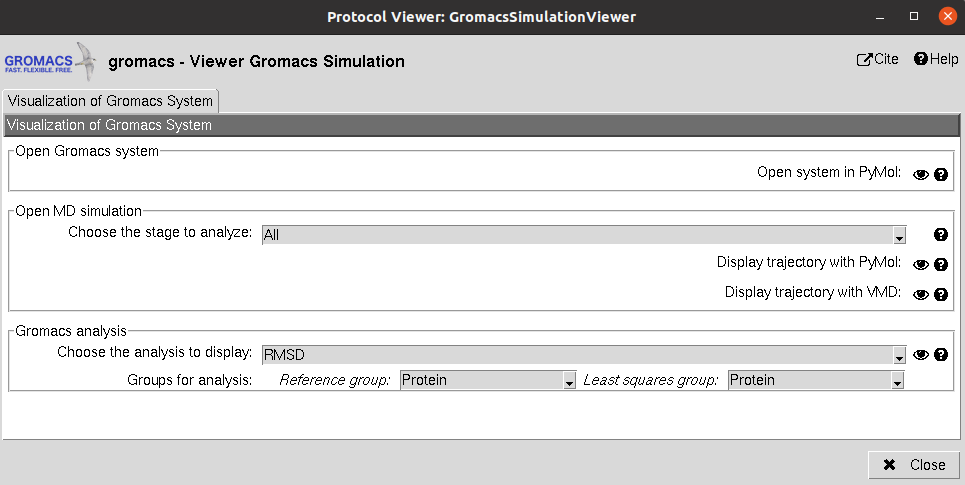

:orphan: true

.. _gromacs-MD_Simulation:

###############################################################
Gromacs Molecular Dynamics (MD) simulation
###############################################################
This protocol takes the prepared Gromacs system and use it to run a defined simulation. In the form, the user can
define different simulation stages that the protocol will run sequentially. The parameters of this protocol are grouped
as:

1) **Input**: The GromacsSystem product of the system preparation described above.

Then, the user can define the different MD stages:

2) **Ensemble**: Defines the type of simulation in the current stage. The user can choose from energy minimization, NVT or NPT. Then, for each of them other parameters will appear to further tune the simulation.

3) **Simulation time**: Defines the length of the simulation in number of steps for the minimization and in time for NVT and NPT. In the case of NVT and NPT, the user can also specify whether the trajectory from the stage should be saved.

4) **Restraints**: Energetic restraints can be defined during the stage for the principal groups of atoms present in the system (Protein, Backbone, C-alpha...)

Then, the defined stage can be inserted into the workflow, whose summary is shown below.

5) **Summary**: A summary of the added stages is shown. However, this list is just a summary and manual modifications will not yield changes. In order to modify the stages, the user need to use the wizards in order to add, delete or watch the parameters of the desired stages, which can be specified in the wizard text input.

|

.. image:: ../../../../../_static/images/plugins/gromacs/gromacs_form2.png
   :alt: gromacs form2

|

The result of this protocol is a GromacsSystem, this time also containing the concatenated trajectory of the
last saved stages (If stages 2, 4 and 5 were saved, since we should not concatenate 2 to 4, only 4 and 5 will be saved).
Using **Analyze Results**, a form with different visualization options will be displayed, where the user can:

|

|

1) **Open Gromacs System**: Display the system (without trajectory) using PyMol

2) **Open MD simulation**: Inspect the system trajectories of the different stages saved using either PyMol (not recommended for long trajectories) or VMD. To facilitate the visualization, only the waters closer to the structure (in the first frame) will be shown.

|

.. figure:: ../../../../_static/images/plugins/gromacs/gromacs_out2_2.png
   :alt: gromacs out2_2

|

3) **Gromacs Analysis**: Perform different `analysis of the trajectories <https://manual.gromacs.org/current/reference-manual/analysis.html>`_ using Gromacs, which will be displayed with matplotlib. Among these analysis we included the variation of RMSD, SASA, Gyration... of the different atom groups through the trajectory.

|

.. figure:: ../../../../_static/images/plugins/gromacs/gromacs_out2_3.png
   :alt: gromacs out2_3

|

.. |testCommand| replace:: gromacs.tests.tests.TestGromacsRunSimulation
.. include:: ../../../../templates/plugins/protocol-test.rst

| 
