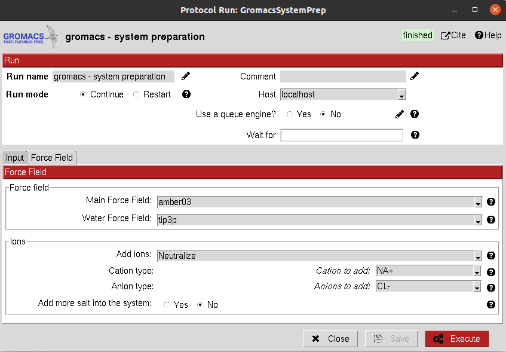

:orphan: true

.. _gromacs-System_Preparation:

###############################################################
Gromacs system preparation
###############################################################
================================
This protocol prepares a Gromacs MD system prior to its simulation from a ``AtomStruct`` object. This protein must have
all the atoms including hydrogens, we recommend you to prepare it first with any of our integrated protocols
for receptor preparation.

It allows the user to create a solute boundary box, define the force field and finally specify the ions in the solute,
which can be set to neutralize the charges, or manually add the desired number.

Unfortunately, as for today we do not include the functionality for preparing complexes containing non-protein atoms,
such as ligands. Hopefully it will be coming soon.

|

|form1| |form1_2|

.. |form1| image:: ../../../../_static/images/plugins/gromacs/gromacs_form1.png
   :alt: gromacs form1
   :width: 45%

|

The result of this protocol is a GromacsSystem, containing the Gromacs coordinates and topology files. The user
can visualize the complex with PyMol using **Analyze Results**.

|

|

.. |testCommand| replace:: gromacs.tests.tests.TestGromacsPrepareSystem
.. include:: ../../../../templates/plugins/protocol-test.rst

| 
