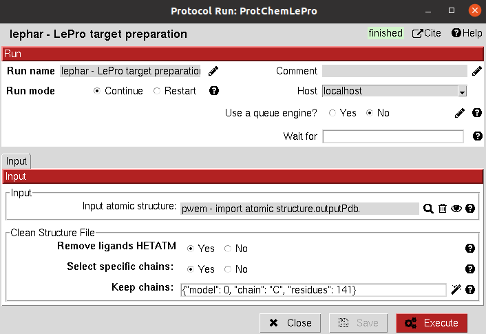

.. _docs-chem-lephar:

.. figure:: ../../../_static/images/lephar/lephar_logo.jpg
   :alt: lephar logo

###############################################################
scipion-chem-lephar
###############################################################
In order to use this plugin, you need to install first Scipion-chem.
`Scipion-chem <https://github.com/scipion-chem/docs>`_
is the core for the rest of scipion-chem-\* plugins. To do so, you can check the instructions in the
`Scipion-chem README <https://github.com/scipion-chem/scipion-chem/blob/master/README.rst>`_.

Similarly, you can find the installation instructions of this plugin in
`Scipion-chem-lephar README <https://github.com/scipion-chem/scipion-chem-lephar/blob/master/README.rst>`_

|

Scipion-chem-lephar overview
******************************************
`LePhar <http://www.lephar.com/>`_ is a suite that provides several tools for Virtual Drug Screening. As for today,
only protocols for preparing the target and docking are integrated in Scipion-chem-lephar.

Scipion-chem-lephar protocols
******************************************

**Receptor preparation**
================================
This protocol prepares the protein receptor for docking using LePro.
LePro is designed to automatically add hydrogen atoms to proteins and/or nucleic acids by explicitely considering the
protonation state of histidine.

From Scipion-chem, we also provide the option of cleaning the structure from HETATM atoms and selecting specific
chains from the input structure.

All parameters include a help button that gives further information for each of them.

|

|

The result of this protocol is an AtomStruct containing the prepared structure.

A test for this protocol can be run using::
    scipion3 tests lephar.tests.test_ledock.TestLePro

|

**Docking**
================================
This protocol performs docking using LeDock. As for the rest of docking programs in Scipion-chem, the docking can be
performed either in the whole structure or on a SetOfStructROIs. Then, the second part of the input is the
SetOfSmallMolecules which will be docked. The docking can be paralelized over the ligands (by default, it is also done
over the StructROIs). Also, an RMSD threshold can be set to automatically discard very similar poses.

|

|

The result of this protocol is a SetOfSmallMolecules containing the docked ligands onto the protein structure.
These molecules can be visualized clicking on "Analyze Results", which will open a for to select visualization of the
whole set, individual StructROIs, all poses of a molecule, single molecules or single molecules using PLIP
(checking interactions).

A test for this protocol can be run using::
    scipion3 tests lephar.tests.test_ledock.TestLeDock

|
