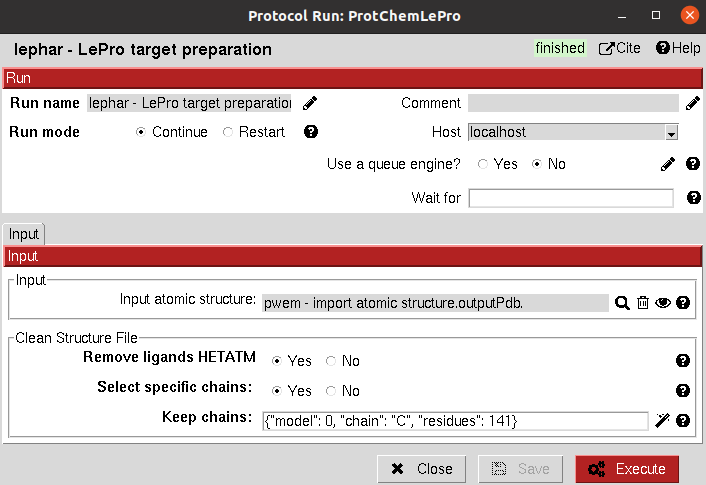

:orphan: true

.. _lephar-LePro:

###############################################################
LePro receptor preparation
###############################################################
================================
This protocol prepares the protein receptor for docking using LePro.
LePro is designed to automatically add hydrogen atoms to proteins and/or nucleic acids by explicitely considering the
protonation state of histidine.

From Scipion-chem, we also provide the option of cleaning the structure from HETATM atoms and selecting specific
chains from the input structure.
|

|

The result of this protocol is an AtomStruct containing the prepared structure.

.. |testCommand| replace:: lephar.tests.test_ledock.TestLePro
.. include:: ../../../../templates/plugins/protocol-test.rst

| 
