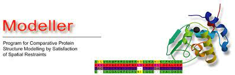

.. |organization| replace:: scipion-chem
.. |repository| replace:: scipion-chem-lephar

.. _docs-chem-modeller:

###############################################################
scipion-chem-modeller
###############################################################
`Modeller <https://salilab.org/modeller/>`_ is a energy-based tool for homology or comparative modeling of protein
three-dimensional structures.

==========================================
Installation
==========================================
A) Requirements
~~~~~~~~~~~~~~~~~~~~~~~~~~~
In order to use this plugin, you need to install first :ref:`pwchem-index`.

B) Installation steps
~~~~~~~~~~~~~~~~~~~~~~~~~~~
.. include:: ../../templates/plugins/installation/installation-steps.rst
.. include:: ../../templates/plugins/installation/only-devel.rst

|

==========================================
Protocols
==========================================

- :ref:`modeller-comparativeModelling`: comparative modelling of a protein sequence using one or several structure templates.
- :ref:`modeller-mutationModelling`: residue mutation modelling and energy optimization.
