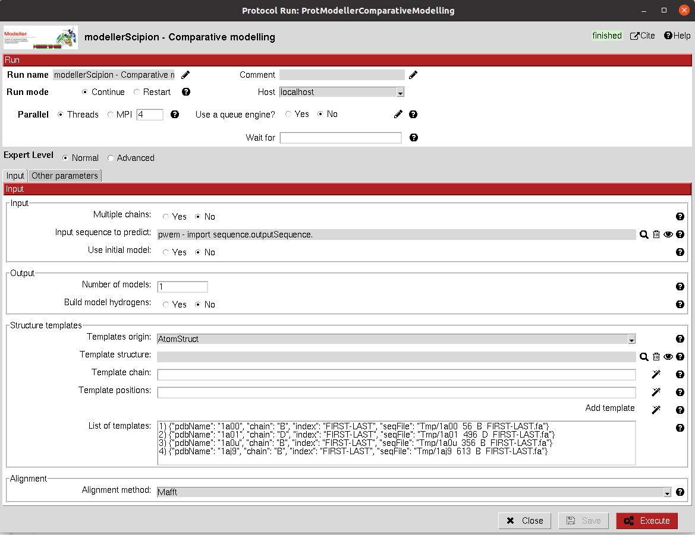

:orphan: true

.. _modeller-comparativeModelling:

###############################################################
Comparative modelling
###############################################################
This protocol follows the `Modeller manual <https://salilab.org/modeller/manual/node15.html>`_ for comparative
modelling of a protein sequence using one or several structure templates. The protocol includes different sections where
you can define the parameters you want to use for the modelling:

1) **Input**: It can either be a protein Sequence (single chain) or a SetOfSequences (multiple chains). You can also input a initial structure model for the sequence(s).

2) **Output**: The number of output models and whether to model also the hydrogens can be specified.

3) **Templates**: You can define the templates from AtomStruct objects in your project or directly from PDB codes. For each of them, you will need to define the chain(s) to use in the modelling and the sequence indexes to take into account. You must use the wizards included in the protocol in order to select the desired chains and positions. Once the chain(s) and positions are selected, use the third wizard to save the template in the list below.

4) **Alignment**: The alignment of the template sequences can be performed using external software included in Scipion-chem (Mafft, Clustal, Muscle), Modeller (AutoModeller) or inputting a custom alignment from a file or SetOfSequencesChem object (be aware that a custom alignment not properly prepared will lead to error).

5) **Scoring**: Different scoring functions provided by Modeller can be checked to score the resulting model(s).

6) **Optimization**: The quality and number of cycles of modelling can also be tuned.

|

|

The result of this protocol is an AtomStruct object for each model generated. In the summary, you can check the score(s)
obtained for each of them. Analyze Results will open all the output models in PyMol for visualization. You can open
them one by one with right click over the object.

.. |testCommand| replace:: modellerScipion.tests.test_comparative_modelling.TestModellerComparativeModelling
.. include:: ../../../../templates/plugins/protocol-test.rst

| 
