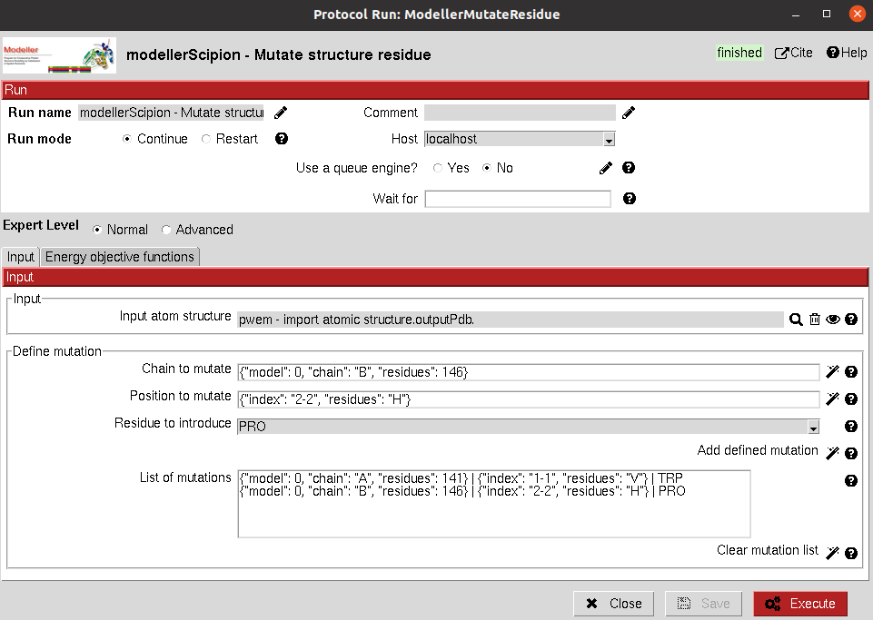

:orphan: true

.. _modeller-mutationModelling:

###############################################################
Mutation modelling
###############################################################
This protocol follows the `Modeller wiki <https://salilab.org/modeller/wiki/Mutate_model>`_ for single residue
mutation modelling and energy optimization. The protocol includes different sections where
you can define the parameters you want to use for the modelling:

1) **Input**: It must be an AtomStruct object containing the protein structure you want to mutate

2) **Define mutation**: You can define the residue in the structure you want to mutate. Using the wizards, you can choose the chain and position from the structure. The third wizard will save the mutation in the list and they will be performed sequentially.

3) **Distance parameters**: The different distances using for determining the interactions can be tuned.

4) **Energy restraints**: Define different restraints on the energy calculations.

|

|

The result of this protocol is an ``AtomStruct`` object with the mutated model.

.. |testCommand| replace:: modellerScipion.tests.test_mutate_residue.TestModellerMutateRes
.. include:: ../../../../templates/plugins/protocol-test.rst

| 
