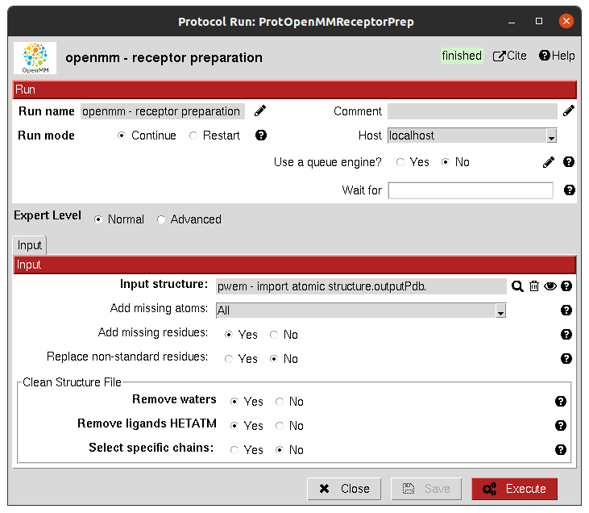
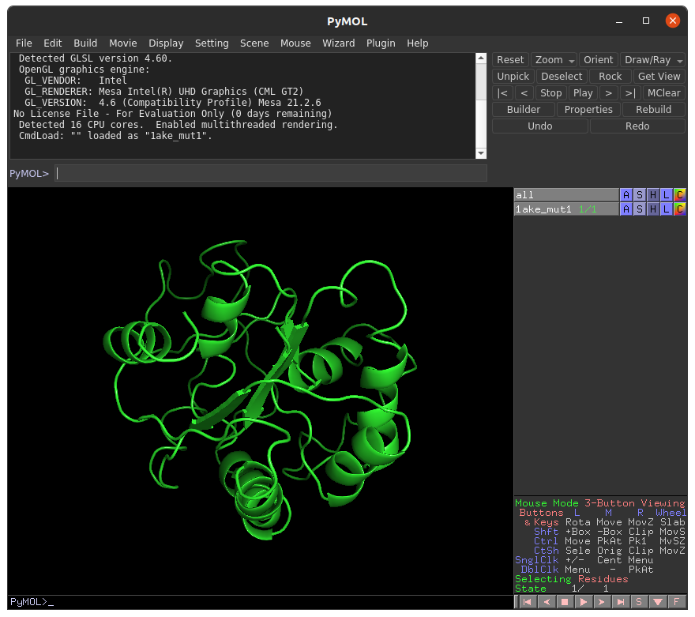

:orphan: true

.. _openmm-Receptor_Preparation:

###############################################################
OpenMM Receptor Preparation
###############################################################
This protocol uses PDBFixer to correct most of the common errors encountered in PDB files and prepares it to be used by OpenMM and other programs.

|

|

The result of this protocol is a ``AtomStruct``, containing the fixed PDB structure, that can be visualized using **Analyze Results**.

|

|

.. |testCommand| replace:: openmm.tests.test_openmm.TestOpenMMPrepareReceptor
.. include:: ../../../templates/plugins/protocol-test.rst

| 
