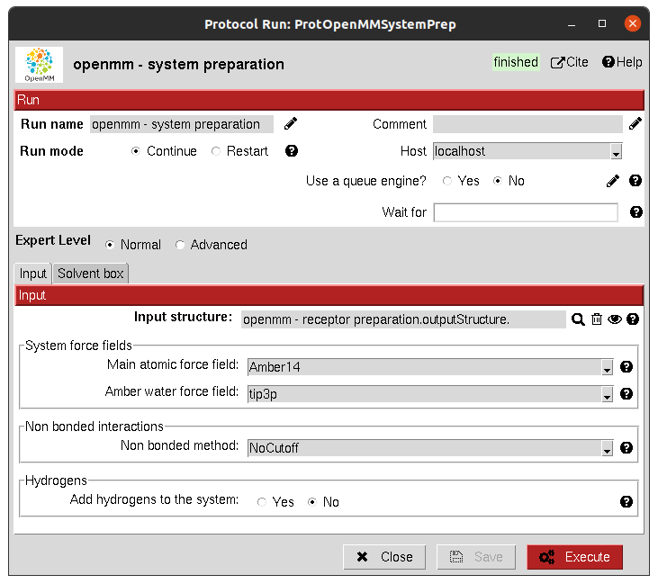
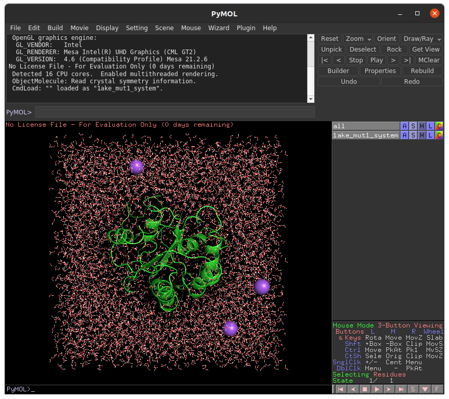

:orphan: true

.. _openmm-system-preparation:

###############################################################
OpenMM System Preparation
###############################################################
This protocol prepares a OpenMM MD System prior to its simulation from a ``AtomStruct`` object.

This protein must have all the atoms including hydrogens, we recommend you to prepare it first with any of our integrated protocols for receptor preparation.

Input
----------------------------------------
.. include:: ../../../templates/plugins/input-help.rst

|

The result of this protocol is a ``OpenMMSystem``, containing the prepared system including receptor and solvent.
It can be visualized using **Analyze Results**.

|

.. |testCommand| replace:: openmm.tests.test_openmm.TestOpenMMPrepareSystem
.. include:: ../../../templates/plugins/protocol-test.rst
