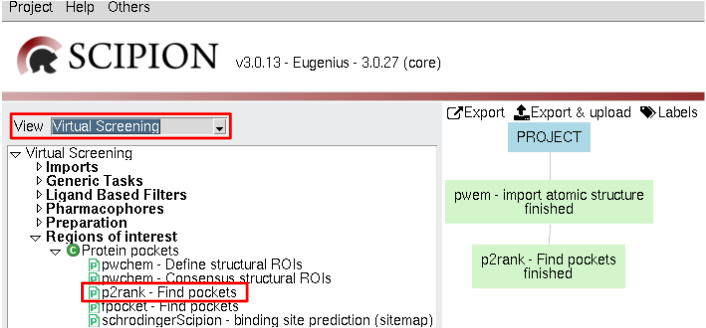
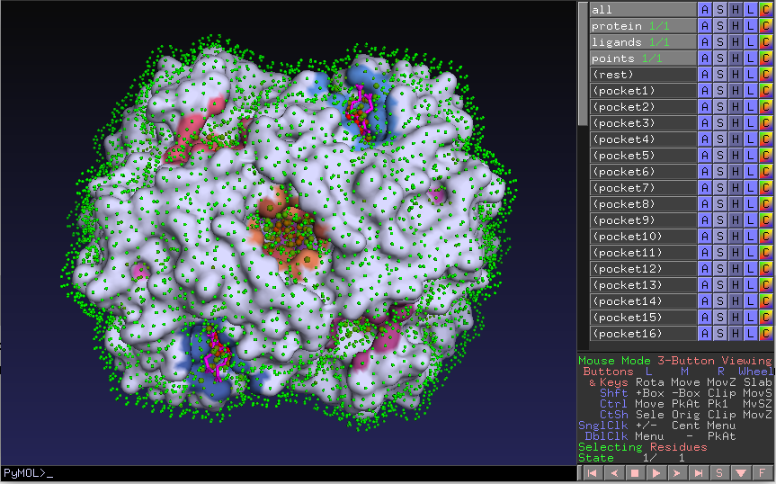

:orphan: true

.. _p2rank-p2rank-prediction:

###############################################################
P2Rank pocket detection
###############################################################
The main program of the `P2Rank <https://github.com/rdk/p2rank>`_ package is P2Rank and it is integrated in Scipion-chem-p2rank as a protocol.

|

|

This protocol takes a ``AtomStruct`` as an input and predicts its pockets based on a machine learning model over its surface. 

You can check the meaning of these parameters in the help button for each of them, and if you need more information
we recommend you to check the `P2Rank page <https://github.com/rdk/p2rank>`_.

|

|

The result of this protocol is a ``SetOfStructROIs`` object, containing the predicted pockets. You can inspect this pockets
using the **Analyze results** button or if you want to directly see the related files you will be able to find them
in the protocol's folder.

.. |testCommand| replace:: p2rank.tests.test_p2rank.TestP2Rank
.. include:: ../../../templates/plugins/protocol-test.rst

| 

Scipion-chem-p2rank viewer
==============================
The viewer for p2rank results include the Pymol General Viewer for SetOfStructROIs objects plus an specific viewer of
the surface points visualization they provide.

|

|viewer|  |surface|

|

As for the rest of the Scipion object, you can also check **Table view** to visualize the stored parameters for each of
the items in the set.

|
