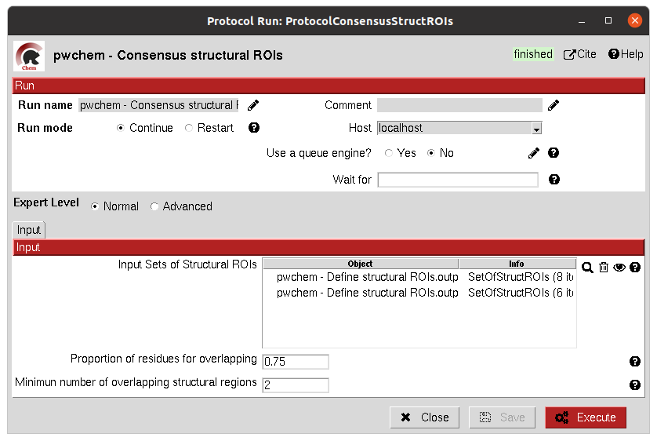
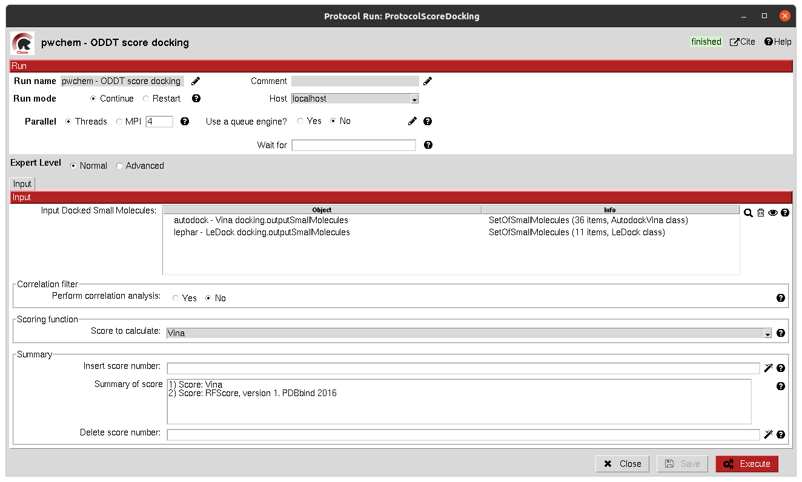

.. _docs-chem:

.. figure:: ../../../_static/images/plugins/pwchem/pwchem_logo.png
   :alt: pwchem logo

###############################################################
scipion-chem
###############################################################
In order to use this plugin, you need to install first `Scipion-em <https://github.com/scipion-em>`_
This plugin, Scipion-chem, is the core for the rest of scipion-chem-\* plugins.

==========================================
Overview
==========================================

`scipion-chem <https://github.com/scipion-chem/scipion-chem>`_ is the core plugin for Virtual Drug Screening (VDS) in
the Scipion platform. It is designed to manage and make interoperable all the the satellite plugins
(Autodock, fpocket,...). It also includes several tools for:

- Managing small molecules, protein structures or molecular dynamics simulations.
- Consensus tools that extract the most relevant results from protein pocket search and docking.
- Visualization of the results for each of the VDS steps.
- Filter and operate the different sets obtained at each step of the workflow.

To do so, scipion-chem automatically installs several util third-party software for the management and visualization of the
tasks in a typical bioinformatics and VDS workflow. These include:

  - `OpenBabel <https://github.com/openbabel/openbabel>`_ and `RDKit <https://github.com/rdkit/rdkit>`_: the main small molecule handlers and converters.
  - `MGLTools <https://ccsb.scripps.edu/mgltools/>`_: utadditional utils for small molecules, docking, ... (includes `AutoDockTools <https://autodocksuite.scripps.edu/adt/>`_).
  - `JChemPaint <https://jchempaint.github.io/>`_: Java program to manually draw small molecules.
  - `Pymol <https://pymol.org/2/>`_: main viewer of Scipion Chem for small molecules and structures.
  - `VMD <https://www.ks.uiuc.edu/Research/vmd/>`_: secondary viewer of Scipion-Chem for structures and Molecular Dynamics.
  - `AliView <https://github.com/AliView/AliView>`_: main viewer for sequences.
  - `PLIP <https://github.com/pharmai/plip>`_: specialized viewer for docking interactions in `Pymol <https://pymol.org/2/>`_.

These programs are managed through conda environments, which also includes different util Python modules.

==========================================
Protocols
==========================================
scipion-chem includes around 40 different protocols subdivided in 4 groups of protocols according to their function:

.. note::
   The user will notice that many protocols have a wand icon next to some of the parameters. 
   We call this button ``wizard`` and they are designed to help the user to use the protocol.
   
   One of the most common types of wizard will help the user to fill a parameter with the proper string.
   
   We strongly recommend to use the wizards to fill these parameters (for some protocols, it is even compulsory), 
   since inappropriate use of the parameters might lead the protocol to fail.

A) General protocols
~~~~~~~~~~~~~~~~~~~~~~~~~~~
It includes protocols for managing the objects or files generated by Scipion.

- `Convert structure <protocols/general/convert-structure>`_: Converts the format of the files stored for a set of Small Molecules, an Atom Structure or a Molecular dynamics system.
- `Operate set <protocols/general/operate-set>`_: Includes several functionalities to modify any Scipion Set inside the project.
- `Add attribute <protocols/general/add-attribute>`_: Allows the user to add an attribute to an item or set object inside Scipion.
- `Export CSV <protocols/general/export-csv>`_: Allows the user to export the SQLite table of a set as a CSV file, containing the values of each attribute for each column and each item in a row.

B) Database protocols
~~~~~~~~~~~~~~~~~~~~~~~~~~~
It includes protocols related to the main databases for protein sequences, structures or small molecules.

- `Import database IDs <protocols/database/import-database-ids>`_: Imports a set of database IDs from a file and stores them as a Scipion object.
- `Identify ligands <protocols/database/identify-ligands>`_: Tries to identify a set of Small Molecules based on the `SMILES <https://es.wikipedia.org/wiki/SMILES>`_ string for each of them.
- `UniProt CrossRef <protocols/database/uniprot-crossref>`_: Searches in the `UniProt <https://www.uniprot.org/>`_ cross reference database for related entries of a set of UniProt IDs for specified databases.
- `ZINC filter <protocols/database/zinc-filter>`_: Filters a ``SetOfSmallMolecules`` by the presence/absence of each of the molecules in the specified ZINC subset(s).
- `Fetch ligands <protocols/database/fetch-ligands>`_: Extracts the ligands related to a ``SetOfDatabaseIDs``.

C) Sequence protocols
~~~~~~~~~~~~~~~~~~~~~~~~~~~
It incorporates protocols for managing biological sequences, including tools for defining sequence regions of interest.

- `Import set of sequences <protocols/sequence/import-set-of-sequences>`_: Imports a set of sequences from one or several fasta files or from a database like `UniProt <https://www.uniprot.org/>`_ using a ``SetOfDatabaseIDs`` as input.
- `Pairwise Alignment <protocols/sequence/pairwise-alignment>`_: Performs a pairwise alignment using clustal omega over two input sequences.
- `Multiple Sequence Alignment <protocols/sequence/multiple-sequence-alignment>`_: Performs a multiple sequence alignment (MSA) over a set of input sequences.
- `Define set of sequences <protocols/sequence/define-set-of-sequences>`_: Allows the user to manually build a set of small molecules from individual elements.
- `Import variants <protocols/sequence/import-variants>`_: Imports a set of sequence variants.
- `Generate variant sequences <protocols/sequence/generate-variant-sequences>`_: Generates a set of sequences from a list of specified variants from a ``SequenceVariants`` object.
- `Import Sequence ROIs <protocols/sequence/import-sequence-rois>`_: Imports a ``SetOfSequenceROIs``, meaning a set of Regions Of Interest (ROI) in a sequence.
- `Define Sequence ROIs <protocols/sequence/define-sequence-rois>`_: Defines a ``SetOfSequenceROIs`` from a ``Sequence`` or ``SequenceVariants`` object.
- `Operate Sequence ROIs <protocols/sequence/operate-sequence-rois>`_: Allows the user to operate sets of sequence ROIs, similarly to the operate sets.
- `Extract Sequence ROIs <protocols/sequence/extract-sequence-rois>`_: Defines a ``SetOfSequenceROIs`` from an input set of sequences based on the conservation of each position in the alignment.
- `Map Sequence ROIs <protocols/sequence/map-sequence-rois>`_: Maps a set of sequence ROIs to an atomic structure where the sequence can be mapped.

D) Virtual Drug Screening protocols
~~~~~~~~~~~~~~~~~~~~~~~~~~~~~~~~~~~~~~~~~~~
Main group of protocols that incorporates most of the functionalities related to the VDS workflow.

- `Import Small Molecules <protocols/virtual-drug-screening/import-small-molecules>`_: Imports a set of small molecules from one or several files or from default database libraries like `ECBL <https://www.eu-openscreen.eu/services/compound-collection/european-chemical-biology-library-ecbl-diversity-library.html>`_ or `ZINC <https://zinc.docking.org/>`_.
- `Extract Small Molecules <protocols/virtual-drug-screening/extract-small-molecules>`_: Extract the small molecules present in a ``AtomStruct`` object.
- `Draw Small Molecules <protocols/virtual-drug-screening/draw-small-molecules>`_: Runs `JChemPaint <https://jchempaint.github.io/>`_ java program and allows the user to draw their own molecules.
- `OpenBabel Prepare Small Molecules <protocols/virtual-drug-screening/openbabel-prepare-small-molecules>`_: Prepares a ``SetOfSmallMolecules`` using `OpenBabel <https://github.com/openbabel/openbabel>`_.
- `RDKit Prepare Small Molecules <protocols/virtual-drug-screening/rdkit-prepare-small-molecules>`_: Prepares a ``SetOfSmallMolecules`` using `RDKit <https://github.com/rdkit/rdkit>`_.
- `Prepare Receptor <protocols/virtual-drug-screening/prepare-receptor>`_: Provides a simple ``AtomStruct`` preparation with `BioPython <https://biopython.org/>`_ where the user can choose different cleaning options like removing waters, heteroatoms, keep only specific chains...
- `ADME Small Molecules filter <protocols/virtual-drug-screening/adme-small-molecules-filter>`_: uses `RDKit <https://github.com/rdkit/rdkit>`_ to filter a ``SetOfSmallMolecules`` by applying the `ADME (Absortion, Distribution, Metabolism, Excretion) filter <https://en.wikipedia.org/wiki/ADME>`_ to each of the small molecules stored.
- `PAINS Small Molecules filter <protocols/virtual-drug-screening/pains-small-molecules-filter>`_: Uses `RDKit <https://github.com/rdkit/rdkit>`_ to filter a ``SetOfSmallMolecules`` by applying the `PAINS (Pan-assay interference compounds) filter <https://en.wikipedia.org/wiki/Pan-assay_interference_compounds>`_ to each of the small molecules stored.
- `Shape Small Molecules filter <protocols/virtual-drug-screening/shape-small-molecules-filter>`_: Uses `RDKit <https://github.com/rdkit/rdkit>`_ to filter a ``SetOfSmallMolecules`` by applying shape filters to each of the small molecules stored.
- `FingerPrint Small Molecules filter <protocols/virtual-drug-screening/fingerprint-small-molecules-filter>`_: Uses `RDKit <https://github.com/rdkit/rdkit>`_ to filter a ``SetOfSmallMolecules`` by applying fingerprint filters to each of the small molecules stored.
- `Pharmacophore generation <protocols/virtual-drug-screening/pharmacophore-generation>`_: Generate a ``Pharmacophore`` object that can be parse by `RDKit <https://github.com/rdkit/rdkit>`_ from a ``SetOfSmallMolecules``.
- `Pharmacophore modification <protocols/virtual-drug-screening/pharmacophore-modification>`_: Modifies the properties of the features inside a ``Pharmacophore`` object.
- `Pharmacophore filtering <protocols/virtual-drug-screening/pharmacophore-filtering>`_: Uses `RDKit <https://github.com/rdkit/rdkit>`_ for filtering a ``SetOfSmallMolecules`` by matching them with a ``Pharmacophore``.

**D.14) Define Structural ROIs (test)**
=============================================

This protocol allows the user to manually define a SetOfStructROIs from AtomStruct objects. The user can define this
structural ROIs in different ways:

- **Coordinates**: directly specify the coordinates of the ROI over the structure
- **Residues**: specify those residues in the protein structure that are ROIs
- **Ligands**: existing ligands in the input structure or external (from another input) small molecules docked to the same structure
- **Protein-Protein Interfaces**: specify the interface of a pair of chains in the structure
- **Near Residues**: specify a pattern of residues that have to exist nearby

The list of input ROI definitions are mapped to actual coordinates, which can optionally be mapped to the protein
surface. These resulting points are clustered to yield the final structural ROIs.

All parameters include a help button that gives further information for each of them.

|

|formD14|

.. |formD14| image:: ../../../_static/images/plugins/pwchem/pwchem_formD14.png
   :alt: pwchem formD14
   :height: 600

|

The result of this protocol is a SetOfStructROIs containing those regions listed in the form.

|

|outD14|

.. |outD14| image:: ../../../_static/images/plugins/pwchem/pwchem_outD14.png
   :alt: pwchem outD14
   :height: 400

|

A test for this protocol can be run using::
    scipion3 tests pwchem.tests.tests_structROIs.TestDefineStructROIs

|

**D.15) Consensus Structural ROIs**
=============================================

This protocol performs a consensus operation over several SetOfStructROIs, studying which of them are shared among all
or a subset of the input sets. The protocol can be used for example to extract the most relevant and robust results
from different methods that predict protein pockets, or to extract which pockets predicted by a certain software overlap
with some interesting regions defined manually.

The protocol works by clustering the structural ROIs from the different inputs and filtering those that are not repeated
sufficiently among the inputs. For a pair of structural ROIs to be considered overlapping, they must share a certain
proportion of their involved residues.

All parameters include a help button that gives further information for each of them.

|

|formD15|

|

The result of this protocol is a SetOfStructROIs containing the consensus structural ROIs.

|

A test for this protocol can be run using::
    scipion3 tests pwchem.tests.tests_structROIs.TestConsensusStructROIs

|

**D.16) Score docking positions**
=============================================

This protocol allows the user to rescore a SetOfSmallMolecules docked to a receptor using several
`ODDT <https://github.com/oddt/oddt>`_ scoring functions. The user may even use several of these functions together
and average them, checking first if they correlate.

All parameters include a help button that gives further information for each of them.

|

|formD16|

|

The result of this protocol is a SetOfSmallMolecules with the calculated ODDT score.

|

A test for this protocol can be run using::
    scipion3 tests pwchem.tests.tests_docking.TestScoreDocking

|

**D.17) RMSD docking**
=============================================

This protocol allows the user to calculate the RMSD between a SetOfSmallMolecules to a reference molecule docked to the
same receptor. The reference molecule can come either from a AtomStruct or a SetOfSmallMolecules.

All parameters include a help button that gives further information for each of them.

|

|formD17_1| |formD17_2|

.. |formD17_1| image:: ../../../_static/images/plugins/pwchem/pwchem_formD17_1.png
   :alt: pwchem formD17_1
   :height: 340

.. |formD17_2| image:: ../../../_static/images/plugins/pwchem/pwchem_formD17_2.png
   :alt: pwchem formD17_2
   :height: 330

|

The result of this protocol is a SetOfSmallMolecules with the calculated RMSD to the reference molecule.

|

A test for this protocol can be run using::
    scipion3 tests pwchem.tests.tests_docking.TestRMSDDocking

|

**D.18) Consensus docking**
=============================================

This protocol performs a consensus operation over several docked SetOfSmallMolecules, studying which positions are
shared among all or a subset of the input sets. Similarly to the Consensus structural ROIs protocol, it might be used
to obtain the most robust results, this time out of different docking protocols.

The clustering of the positions is performed based on their RMSD and different options can be chosen. The default option
will use scipy package for the clustering, allowing parallelization and using an optimized code. However, due to the
quadratic nature of the problem, this might be too computationally expensive, so we offer another option where the
clusters are formed calculating only the distance to each cluster representative. This representative is the molecule
of the cluster that has the smallest energy or biggest score. The clustering using this method is not as robust and will
depend on the molecules order, but the problem will no longer be quadratic. Choose your best option wisely.

All parameters include a help button that gives further information for each of them.

|

|formD18_1|

.. |formD18_1| image:: ../../../_static/images/plugins/pwchem/pwchem_formD18_1.png
   :alt: pwchem formD18_1
   :height: 600

|

The result of this protocol is a SetOfSmallMolecules with the consensus docking positions.

|

A test for this protocol can be run using::
    scipion3 tests pwchem.tests.tests_docking.TestConsensusDocking

|

**D.19) SASA calculation**
=============================================

This protocol uses BioPython to calculate the SASA (Solvent-Accessible Surface Area) for each residue in an AtomStruct.

All parameters include a help button that gives further information for each of them.

|

|formD19_1| |formD19_2|

.. |formD19_1| image:: ../../../_static/images/plugins/pwchem/pwchem_formD19_1.png
   :alt: pwchem formD19_1
   :height: 425

.. |formD19_2| image:: ../../../_static/images/plugins/pwchem/pwchem_formD19_2.png
   :alt: pwchem formD19_2
   :height: 425

|

The result of this protocol is an AtomStruct containing the SASA value for each reside of the receptor, which can be
visualized in the Analyzed results.

|

|outD19_1|

.. |outD19_1| image:: ../../../_static/images/plugins/pwchem/pwchem_outD19_1.png
   :alt: pwchem outD19_1
   :height: 500

|

Additionally, the protocol can also output a SetOfSequenceROIs with those residues with SASA values higher/lower than a
threshold. The user can preview the SASA values in the protocol to define the threshold.

|

|outD19_2|

.. |outD19_2| image:: ../../../_static/images/plugins/pwchem/pwchem_outD19_2.png
   :alt: pwchem outD19_2
   :height: 200

|

A test for this protocol can be run using::
    scipion3 tests pwchem.tests.tests_attributes.TestCalculateSASA
