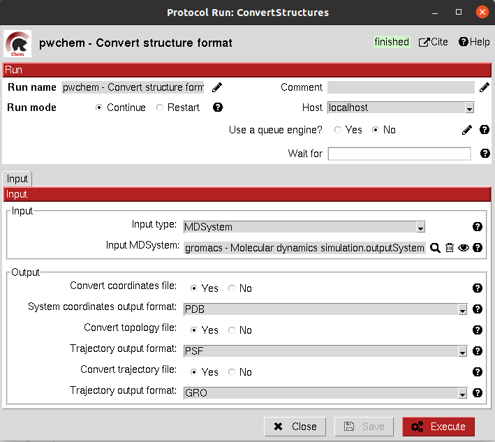

.. _docs-convert-structure:

###############################################################
Convert structure
###############################################################
This protocol converts the format of the files stored for a set of Small Molecules, an Atom Structure or a Molecular
dynamics system (either coordinates, topology or trajectory files).

In order to do the conversions, we use RDKit or OpenBabel for small molecules, biopython for Atom Structures and parmed
and mdtraj for Molecular Dynamics systems.

All parameters include a help button that gives further information for each of them.

|

|formA1_1| |formA1_2|

.. |formA1_1| image:: ../../../../_static/images/pwchem/pwchem_formA1_1.png
   :alt: pwchem formA1_1
   :height: 400

|

The result of this protocol is object equal to the one in the input, but this time the files inside this object are in
the desired format.

|

A test for this protocol can be run using::
    scipion3 tests pwchem.tests.tests_general.TestConverter

|