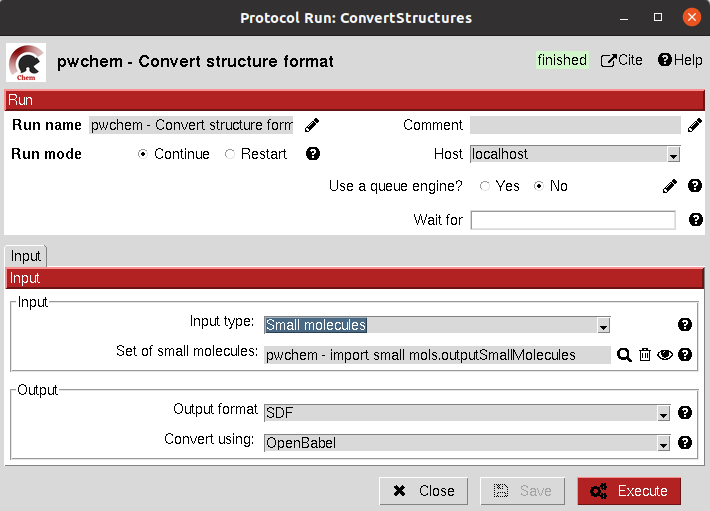

.. _docs-convert-structure:

###############################################################
Convert structure
###############################################################
This protocol converts the format of the files stored for a set of Small Molecules, an Atom Structure or a Molecular
dynamics system (either coordinates, topology or trajectory files).

In order to do the conversions, we use `RDKIT <https://github.com/rdkit/rdkit>`_ or `OpenBabel <https://github.com/openbabel/openbabel>`_ 
for small molecules, `Biopython <https://biopython.org/>`_ for Atom Structures and `Parmed <https://parmed.github.io/ParmEd/html/index.html>`_
and `MDTraj <https://www.mdtraj.org/1.9.8.dev0/index.html>`_ for Molecular Dynamics systems.

Input
----------------------------------------
All parameters include a help button that gives further information for each of them.

.. image:: ../../../../_static/images/pwchem/convert-structure/form_2.png
   :alt: pwchem formA1_1
   :height: 400
   :align: center

|

|

The result of this protocol is object equal to the one in the input, but this time the files inside this object are in
the desired format.

Test
----------------------------------------
This protocol has an integrated test that can be run using the following command:

.. code-block::

   scipion3 tests pwchem.tests.tests_general.TestConverter
