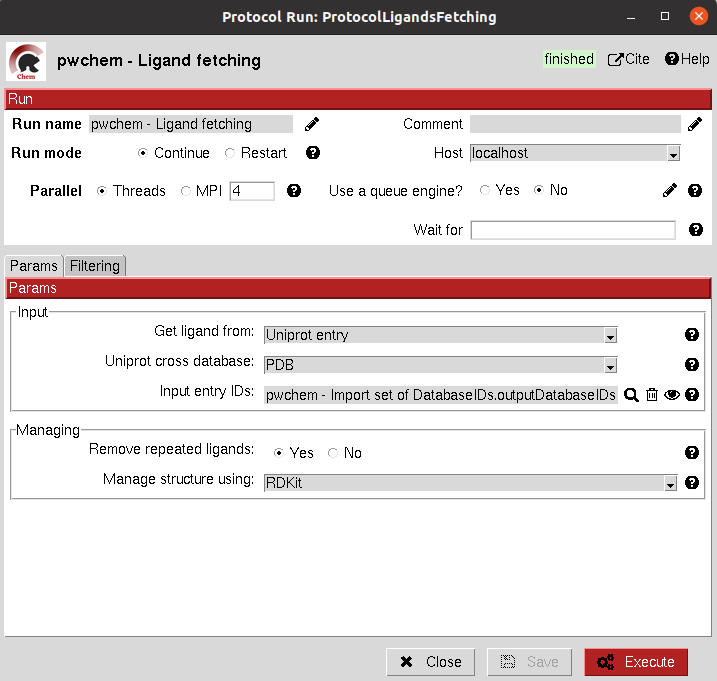
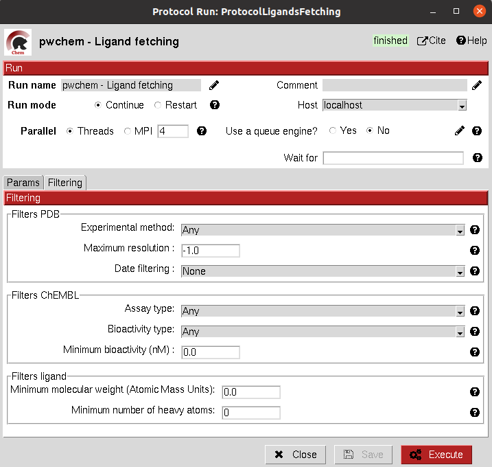

:orphan: true

.. _pwchem-fetch-ligands:

###############################################################
Fetch ligands
###############################################################
This protocol extracts the ligands related to a ``SetOfDatabaseIDs``. It defines 3 levels of relation depending on the
database IDs:

- **UniProt IDs**: using their cross references with an specified database, it will relate each UniProt ID to a number of target structures and extract their ligands.
- **Target IDs**: the IDs refer to a protein target. The protocol will extract all ligands found in the structure.
- **Ligand IDs**: the IDs refer directly to the IDs of the ligands in the specified database.

.. note::
   In a second section, you can define several filters for the extracted ligands, from general ones according to the
   ligand structure to more specific depending on the chose database.

Input
----------------------------------------
.. include:: ../../../../templates/plugins/input-help.rst

|

|

The result of this protocol is a ``SetOfSmallMolecules`` with the extracted ligands.

.. |testCommand| replace:: pwchem.tests.tests_databases.TestFetchLigands
.. include:: ../../../../templates/plugins/protocol-test.rst
