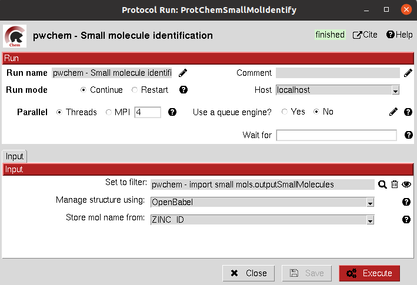

.. _docs-identify-ligands:

###############################################################
Identify ligands
###############################################################
This protocol tries to identify a set of Small Molecules based on the `SMILES <https://es.wikipedia.org/wiki/SMILES>`_ string for each of them. To do so, it uses
the `PubChem API <https://pubchem.ncbi.nlm.nih.gov/docs/pug-rest>`_. If no exact match is found, it looks for similar
compounds (which are specified in a summary file) and outputs the most similar. The protocol further identifies the
small molecule by using the `PubChem <https://pubchem.ncbi.nlm.nih.gov/>`_ cross references to extract the ID from other databases 
(currently `ZINC <https://zinc.docking.org/>`_ and `ChEMBL <https://www.ebi.ac.uk/chembl/>`_).
All this identifiers are stored in the object, and the user can choose to switch the main molecule name by one of them.

Input
----------------------------------------
.. include:: ../../../../templates/plugins/input-help.rst

|

The result of this protocol is a ``SetOfSmallMolecules`` which includes the found identifiers for each molecule.

.. image:: ../../../../../_static/images/plugins/pwchem/database/identify-ligands/output.png
   :alt: Identify ligands output
   :align: center

|

.. |testCommand| replace:: pwchem.tests.tests_databases.TestIdentifyLigands
.. include:: ../../../../templates/plugins/protocol-test.rst
