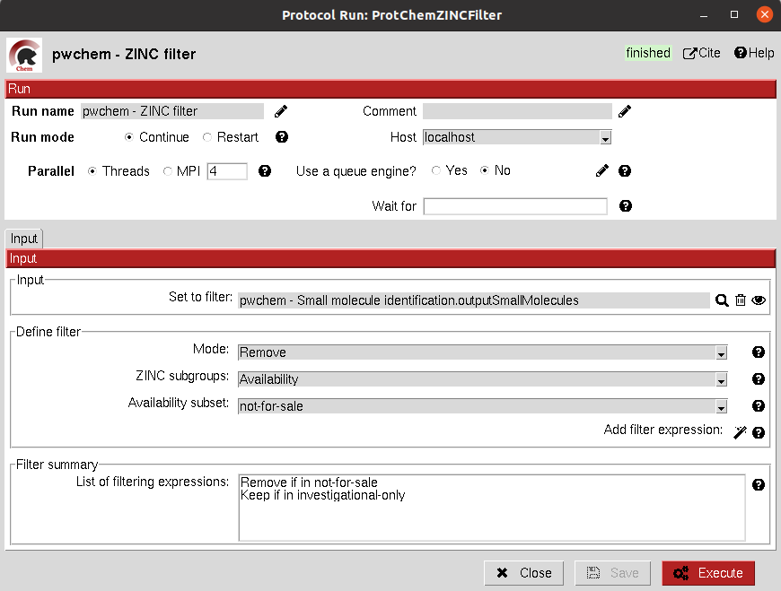

.. _docs-zinc-filter:

###############################################################
ZINC filter
###############################################################
This protocol filters a ``SetOfSmallMolecules`` by the presence/absence of each of the molecules in the specified ZINC
subset(s). To do so, the molecules must have a ZINC ID, either in the MolName or in a ZINC_ID attribute
(easy to get using the Identify ligands protocol).
You can find the different defined ZINC subsets in https://zinc15.docking.org/substances/subsets/.

Input
----------------------------------------
All parameters include a help button that gives further information for each of them.

|

The result of this protocol is a ``SetOfSmallMolecules`` where those molecules in the input that did not match the subgroup
filters have been removed.

Test
----------------------------------------
This protocol has an integrated test that can be run using the following command:

.. code-block::

   scipion3 tests pwchem.tests.tests_databases.TestZINCFilter
