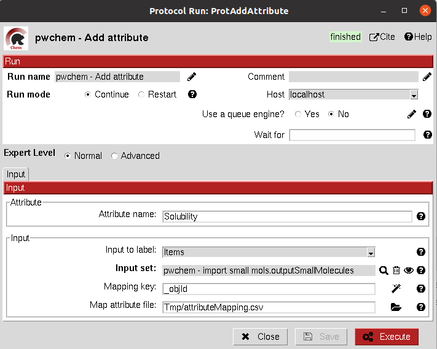

:orphan: true

.. _pwchem-add-attribute:

###############################################################
Add attribute
###############################################################
This protocol allows the user to add an attribute to an item or set object inside Scipion. It has somehow a similar but
contrary function than the "Remove column" operation of the `Operate set <operate-set>`_ protocol, but the definition of the input can
be a bit more complex.

Input
----------------------------------------
.. include:: ../../../../templates/plugins/input-help.rst

.. image:: ../../../../../_static/images/plugins/pwchem/general/add-attribute/form_1.png
   :alt: Add attribute form 1
   :height: 400
   :align: center

|

|

The result of this protocol is object equal to the one in the input, but this time the files inside this object are in
the desired format.

Before:

.. image:: ../../../../../_static/images/plugins/pwchem/general/add-attribute/output_1.png
   :alt: Add attribute output 1
   :align: center

|

After:

.. image:: ../../../../../_static/images/plugins/pwchem/general/add-attribute/output_1.png
   :alt: Add attribute output 2
   :align: center

|

.. |testCommand| replace:: pwchem.tests.tests_attributes.TestAddAttribute
.. include:: ../../../../templates/plugins/protocol-test.rst
