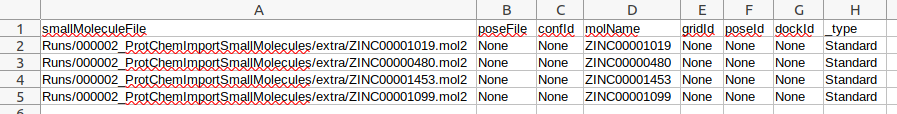

.. _docs-export-csv:

###############################################################
Export CSV
###############################################################
This protocol allows the user to export the SQLite table of a set as a CSV file, containing the values of each attribute
for each column and each item in a row. This protocol might be useful for further exploring the attributes of a Set.

Input
----------------------------------------
.. include:: ../../../../templates/plugins/input-help.rst

.. image:: ../../../../../_static/images/pwchem/general/export-csv/form.png
   :alt: Export CSV form
   :height: 400
   :align: center

|

The result of this protocol is a ``CSV`` file in the protocol folder. It has no Scipion output object.

|

.. |testCommand| replace:: pwchem.tests.tests_general.TestExportcsv
.. include:: ../../../../templates/plugins/protocol-test.rst
