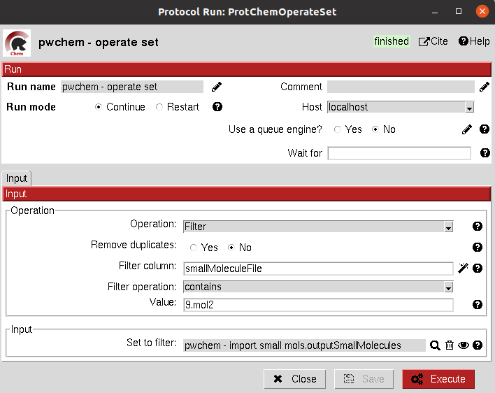

.. _docs-operate-set:

###############################################################
Operate set
###############################################################
This protocol includes several functionalities to modify any Scipion Set inside the project. It handles the internal
SQLite representation to modify the set object. The user must define a reference attribute of the items which will
determine the function of the protocol:

- *Unique*: keeps only one of the elements which have the referent attribute repeated.
- *Union*: merges two sets of the same type. The user can still perform the Unique operation after that.
- *Intersection*: keeps only the intersection of several sets, using the reference attribute.
- *Difference*: keeps the elements of the first set that are not repeated in the second set
- *Filter*: filters the set based on a filter attribute value and a filter operation the user can specify. Keeps only the elements that pass the filter.
- *Remove columns*: remove a column or attribute from a Set object
- *Ranking*: sorts the elements of a Set based on the filter column and keeps only those elements above/below a defined threshold.

These operations have some shared functionalities with "edit set" and "filter set" protocols from `scipion-em <https://github.com/scipion-em/scipion-em>`_. The user
is free to choose among them.

Input
----------------------------------------
All parameters include a help button that gives further information for each of them.

.. image:: ../../../../../_static/images/pwchem/operate-set/form_1.png
   :alt: Operate set form 1
   :height: 400

|

|

The result of this protocol is object equal to the one in the input, but this time the files inside this object are in
the desired format.

Test
----------------------------------------
This protocol has an integrated test that can be run using the following command:

.. code-block::

   scipion3 tests pwchem.tests.tests_general.TestOperateSet
