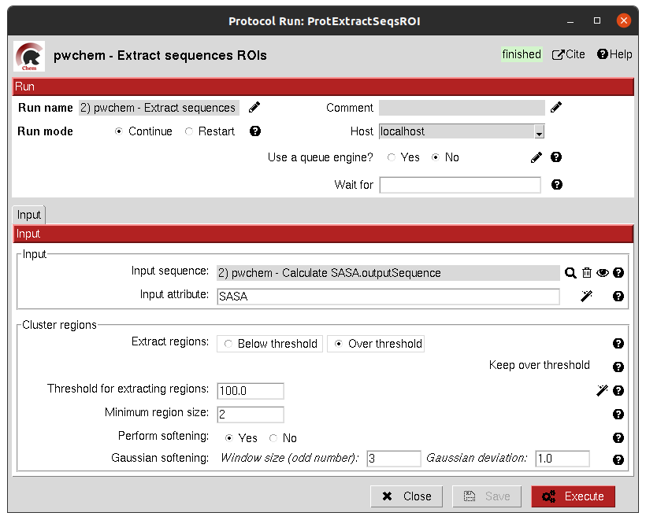
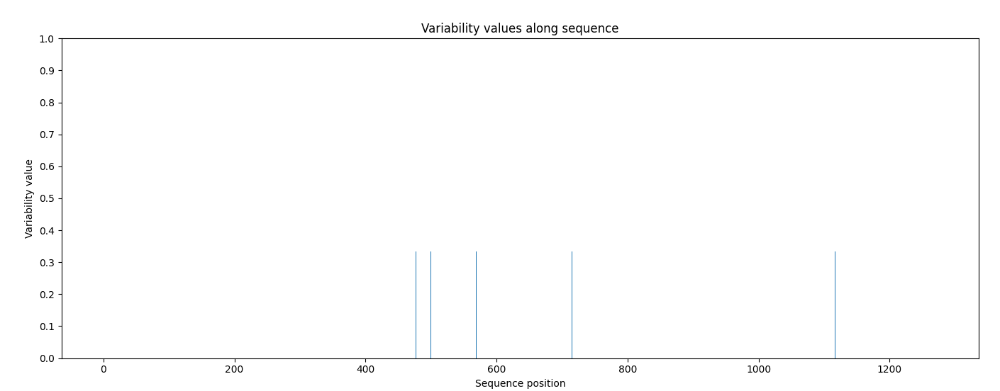

:orphan: true

.. _pwchem-extract-sequence-rois:

###############################################################
Extract Sequence ROIs
###############################################################
This protocol defines a ``SetOfSequenceROIs`` from an input set of sequences based on the conservation of each position
in the alignment. If the user provides an input structure which can be aligned to the input sequences, the regions
can also be mapped to the structure.

The conserved / variable regions are defined based on a threshold. The user can preview the conservation values of
the alignment in order to tune this threshold.

Input
----------------------------------------
.. include:: ../../../../templates/plugins/input-help.rst

|

.. note::
   At some point in the future, the user will be able to extract sequence ROIs from other attributes than conservation.

The result of this protocol is a ``SetOfSequenceROIs`` with the regions whose the conservation values or over / below the
threshold set. If the input structure is provided, an ``AtomStruct`` object is also output. Using analyze results,
the user can visualize the conservation values over the structure.

|

.. |testCommand| replace:: pwchem.tests.tests_sequences.TestExtractSequenceROIs
.. include:: ../../../../templates/plugins/protocol-test.rst
