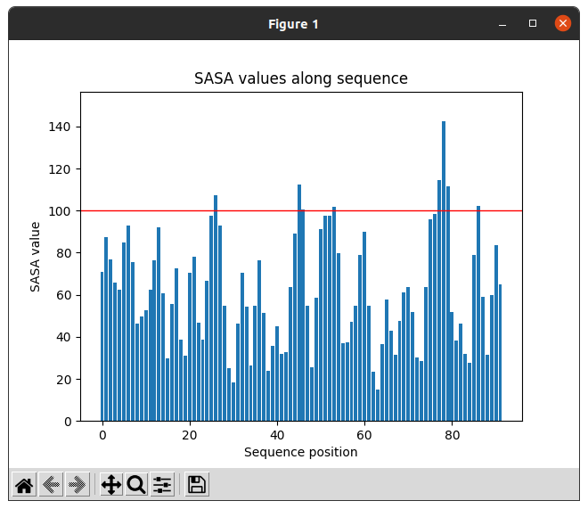

:orphan: true

.. _pwchem-extract-sequence-rois:

###############################################################
Extract Sequence ROIs
###############################################################
This protocol defines a ``SetOfSequenceROIs`` from an input ``SequenceChem`` based on the values of an attribute stored in this sequence object. 

Input
----------------------------------------
.. include:: ../../../../templates/plugins/input-help.rst

.. image:: ../../../../../_static/images/plugins/pwchem/sequence/extract-sequence-rois/form.png
   :alt: Extract Sequence ROIs form
   :height: 400
   :align: center

|

The user can preview the attribute values through the sequence in order to tune this threshold.

|

The result of this protocol is a ``SetOfSequenceROIs`` with the regions whose attribute values or over / below the threshold set.

|

.. |testCommand| replace:: pwchem.tests.tests_sequences.TestExtractSequenceROIs
.. include:: ../../../../templates/plugins/protocol-test.rst

|
