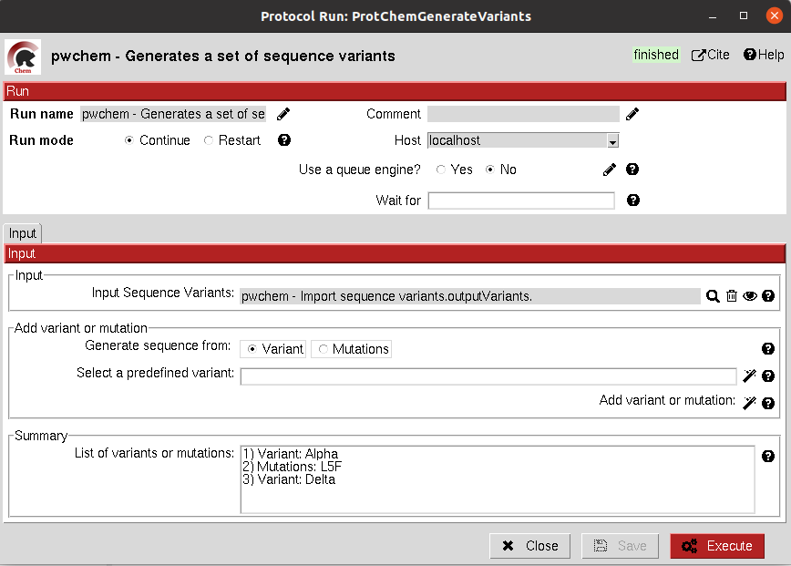
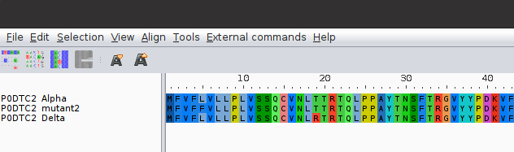

.. _docs-generate-variant-sequences:

###############################################################
Generate variant sequences
###############################################################
This protocol generates a set of sequences from a list of specified variants from a ``SequenceVariants`` object.

Input
----------------------------------------
.. include:: ../../../../templates/plugins/input-help.rst

|

The result of this protocol is a ``SetOfSequences`` which contains all the defined variants or single mutations from the input.

|

.. |testCommand| replace:: pwchem.tests.tests_sequences.TestGenerateSequences
.. include:: ../../../../templates/plugins/protocol-test.rst
