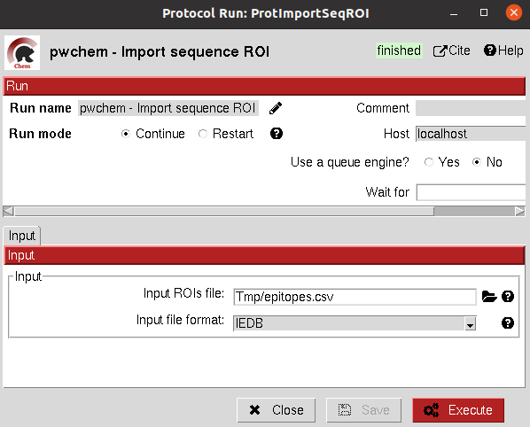

:orphan: true

.. _pwchem-import-sequence-rois:

###############################################################
Import Sequence ROIs
###############################################################
This protocol imports a ``SetOfSequenceROIs``, meaning a set of Regions Of Interest (ROI) in a sequence. As for today,
this protocol is oriented to epitopes defined in `IEDB <https://www.iedb.org/>`_. More origins of these ROIs will be
added in the future.

Input
----------------------------------------
.. include:: ../../../../templates/plugins/input-help.rst

|

The result of this protocol are several ``SetOfSequenceROIs``, one for each sequence defined in the input,
where the defined ROIs are those epitopes defined in the input.

.. |testCommand| replace:: pwchem.tests.tests_imports.TestImportSeqROIs
.. include:: ../../../../templates/plugins/protocol-test.rst
