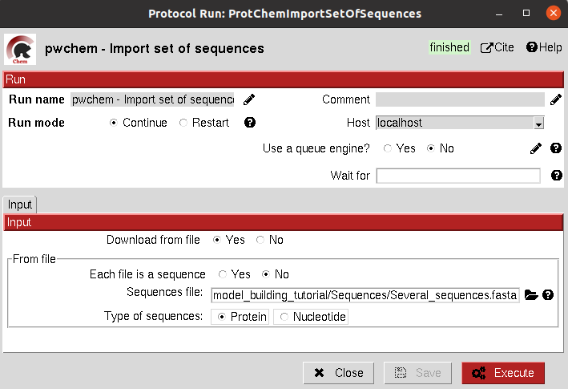
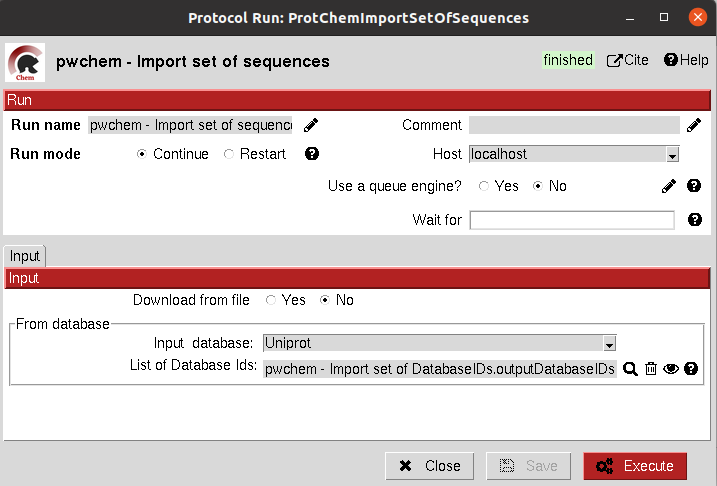
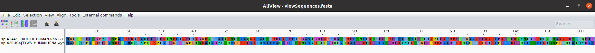

.. _pwchem-import-set-of-sequences:

###############################################################
Import set of sequences
###############################################################
This protocol imports a set of sequences from one or several fasta files or from a database like `UniProt <https://www.uniprot.org/>`_ 
using a ``SetOfDatabaseIDs`` as input.

Input
----------------------------------------
.. include:: ../../../../templates/plugins/input-help.rst

|

|

The result of this protocol is a ``SetOfSequences`` with the specified sequences.

|

.. |testCommand| replace:: pwchem.tests.tests_imports.TestImportSequences
.. include:: ../../../../templates/plugins/protocol-test.rst
