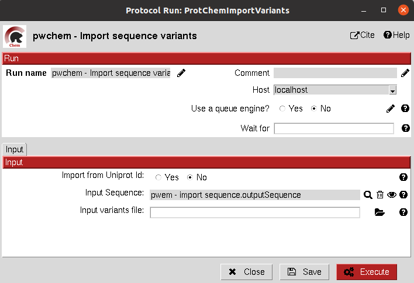

.. _pwchem-import-variants:

###############################################################
Import variants
###############################################################
This protocol imports a set of sequence variants. These can be imported either from the natural defined in a single
UniProt ID or with a customized file defining single point mutations.

Input
----------------------------------------
.. include:: ../../../../templates/plugins/input-help.rst

.. image:: ../../../../../_static/images/plugins/pwchem/sequence/import-variants/form_1.png
   :alt: Import variants form 1
   :height: 400
   :align: center

|

|

The result of this protocol is a ``SequenceVariant`` object containing the original sequence with the defined variants.

.. image:: ../../../../../_static/images/plugins/pwchem/sequence/import-variants/output.png
   :alt: Import variants output
   :height: 400
   :align: center

|

.. |testCommand| replace:: pwchem.tests.tests_imports.TestImportVariants
.. include:: ../../../../templates/plugins/protocol-test.rst
