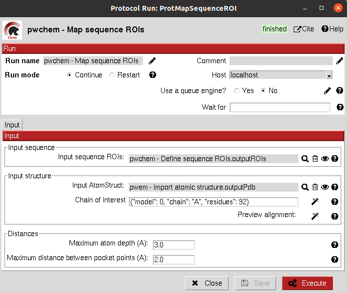

.. _docs-map-sequence-rois:

###############################################################
Map Sequence ROIs
###############################################################
This protocol maps a set of sequence ROIs to an atomic structure where the sequence can be mapped. The alignment of the
sequence that contains the ROIs and the one coming from the structure can be previewed. Then, those residues defined as
sequence ROIs are mapped to the surface of the structure and those surface regions next to each other are clustered
to build structural ROIs.

Input
----------------------------------------
.. include:: ../../../../templates/plugins/input-help.rst

|

The result of this protocol is a ``SetOfStructROIs`` with the mapped sequence ROIs over the input structure.

.. image:: ../../../../../_static/images/pwchem/sequence/map-sequence-rois/output.png
   :alt: Map Sequence ROIs output
   :height: 600
   :align: center

|

.. |testCommand| replace:: pwchem.tests.tests_sequences.TestMapSeqROIs
.. include:: ../../../../templates/plugins/protocol-test.rst
