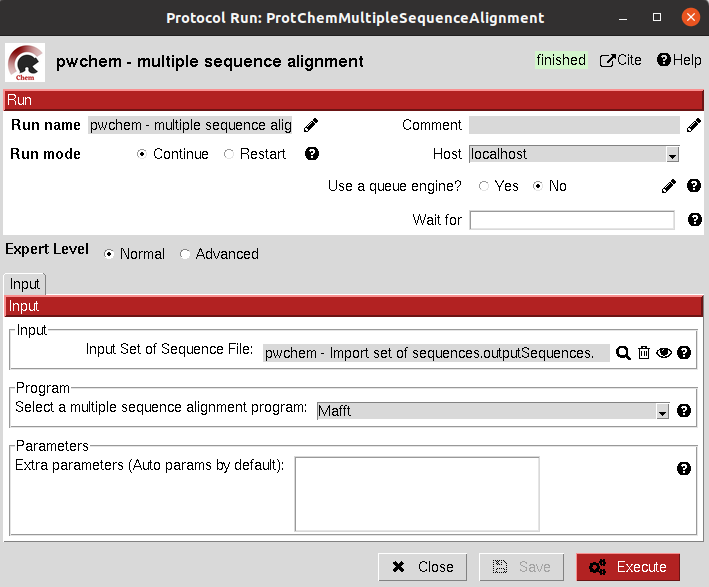

.. _pwchem-multiple-sequence-alignment:

###############################################################
Multiple Sequence Alignment
###############################################################
This protocol performs a multiple sequence alignment (MSA) over a set of input sequences.
The alignment can be performed using either `Clustal Omega <https://www.ebi.ac.uk/Tools/msa/clustalo/>`_, 
`Muscle <https://www.ebi.ac.uk/Tools/msa/muscle/>`_ or `Mafft <https://mafft.cbrc.jp/alignment/server/index.html>`_, 
which are automatically installed in the scipion-chem plugin. Additional parameters for each of the programs can be manually input.

Input
----------------------------------------
.. include:: ../../../../templates/plugins/input-help.rst

|

The result of this protocol is a ``SetOfSequences`` with the two input sequences aligned.

.. image:: ../../../../../_static/images/plugins/pwchem/sequence/multiple-sequence-alignment/output.png
   :alt: Multiple Sequence Alignment output
   :align: center

|

.. |testCommand| replace:: pwchem.tests.tests_sequences.TestMultipleAlignSequences
.. include:: ../../../../templates/plugins/protocol-test.rst
