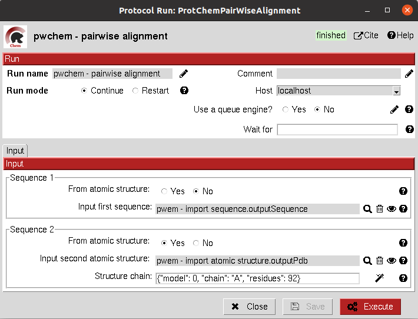
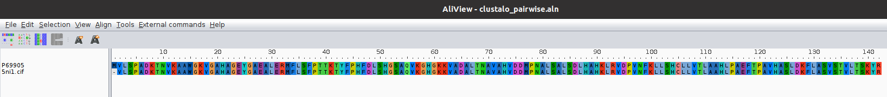

.. _pwchem-pairwise-alignment:

###############################################################
Pairwise Alignment
###############################################################
This protocol performs a pairwise alignment using clustal omega over two input sequences.
These sequences can be input either from a ``Sequence`` or an ``AtomStruct`` object, in the later,
the chain must also be specified.

Input
----------------------------------------
.. include:: ../../../../templates/plugins/input-help.rst

|

The result of this protocol is a ``SetOfSequences`` with the two input sequences aligned.

|

.. |testCommand| replace:: pwchem.tests.tests_sequences.TestPairwiseAlign
.. include:: ../../../../templates/plugins/protocol-test.rst
