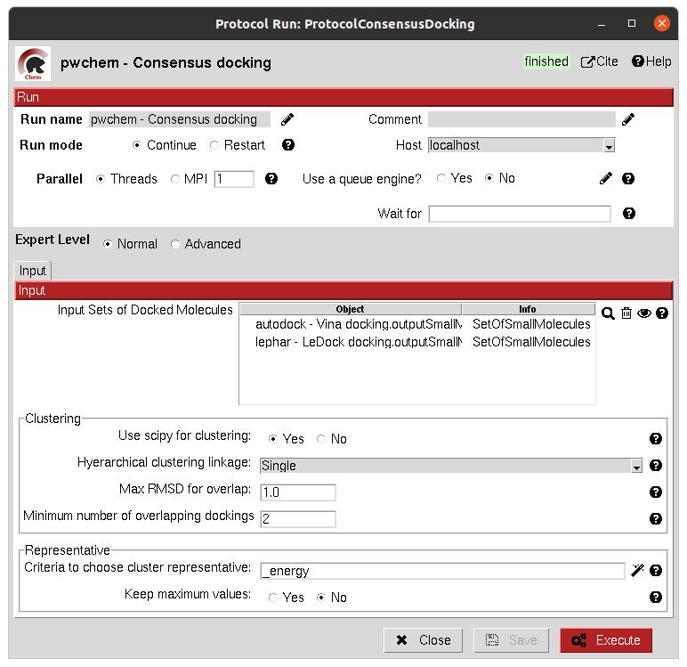
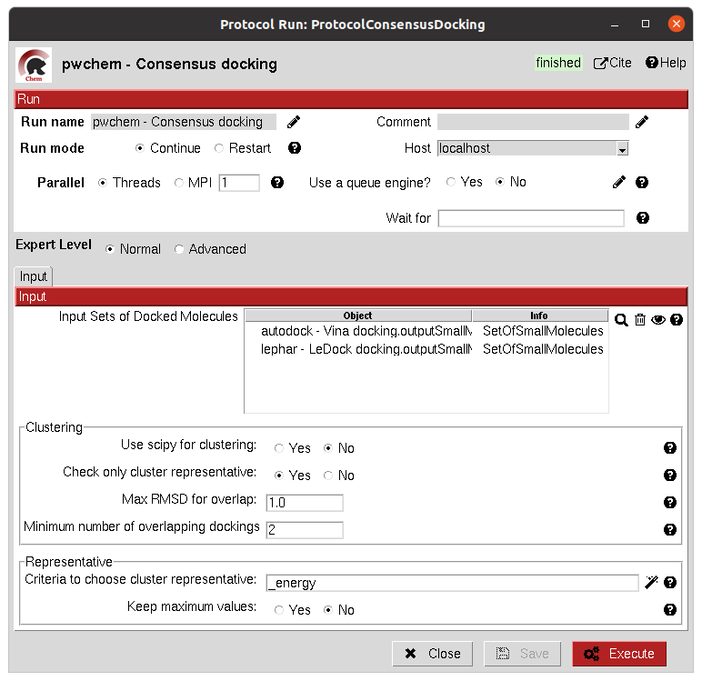

.. _pwchem-consensus-docking:

###############################################################
Consensus docking
###############################################################
This protocol performs a consensus operation over several docked ``SetOfSmallMolecules``, studying which positions are
shared among all or a subset of the input sets. Similarly to the `Consensus structural ROIs <consensus-structural-rois>`_ 
protocol, it might be used to obtain the most robust results, this time out of different docking protocols.

The clustering of the positions is performed based on their RMSD and different options can be chosen. The default option
will use scipy package for the clustering, allowing parallelization and using an optimized code. However, due to the
quadratic nature of the problem, this might be too computationally expensive, so we offer another option where the
clusters are formed calculating only the distance to each cluster representative. This representative is the molecule
of the cluster that has the smallest energy or biggest score. The clustering using this method is not as robust and will
depend on the molecules order, but the problem will no longer be quadratic. Choose your best option wisely.

Input
----------------------------------------
.. include:: ../../../../templates/plugins/input-help.rst

|

|

The result of this protocol is a ``SetOfSmallMolecules`` with the consensus docking positions.

.. |testCommand| replace:: pwchem.tests.tests_docking.TestConsensusDocking
.. include:: ../../../../templates/plugins/protocol-test.rst