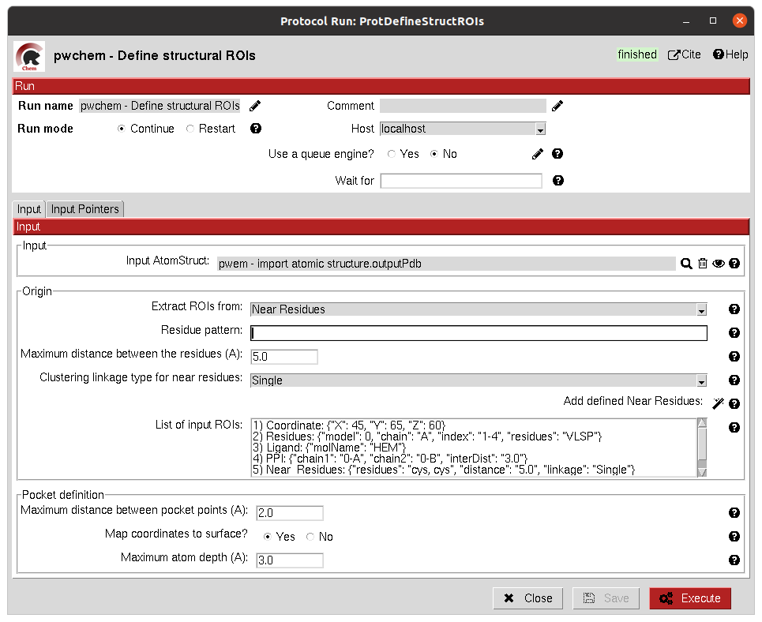
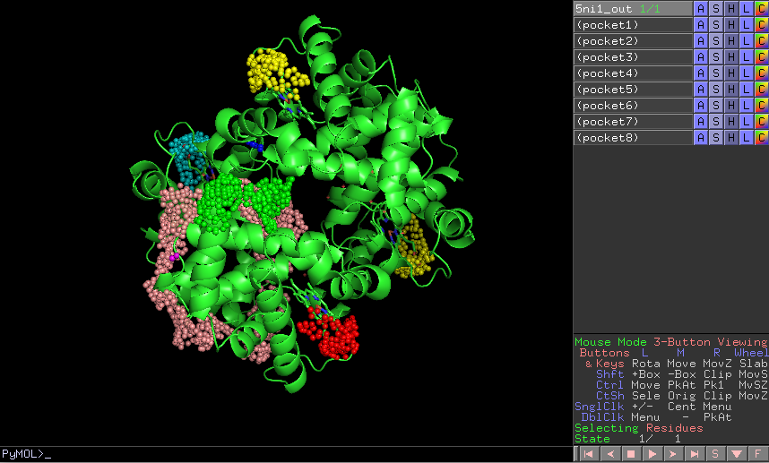

.. _pwchem-define-structural-rois:

###############################################################
Define Structural ROIs
###############################################################
This protocol allows the user to manually define a ``SetOfStructROIs`` from ``AtomStruct`` objects. The user can define this
structural ROIs in different ways:

- **Coordinates**: directly specify the coordinates of the ROI over the structure.
- **Residues**: specify those residues in the protein structure that are ROIs.
- **Ligands**: existing ligands in the input structure or external (from another input) small molecules docked to the same structure.
- **Protein-Protein Interfaces**: specify the interface of a pair of chains in the structure.
- **Near Residues**: specify a pattern of residues that have to exist nearby.

The list of input ROI definitions are mapped to actual coordinates, which can optionally be mapped to the protein
surface. These resulting points are clustered to yield the final structural ROIs.

Input
----------------------------------------
.. include:: ../../../../templates/plugins/input-help.rst

|

The result of this protocol is a ``SetOfStructROIs`` containing those regions listed in the form.

|

.. |testCommand| replace:: pwchem.tests.tests_structROIs.TestDefineStructROIs
.. include:: ../../../../templates/plugins/protocol-test.rst