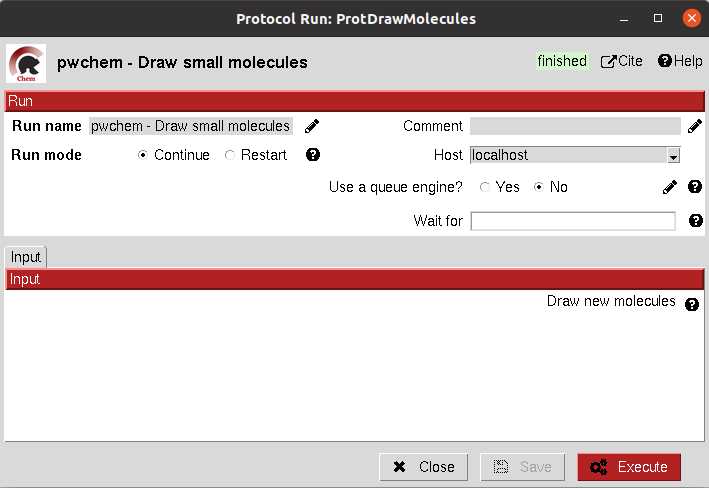

:orphan: true
.. _pwchem-draw-small-molecules:

###############################################################
Draw Small Molecules
###############################################################
This protocol runs `JChemPaint <https://jchempaint.github.io/>`_ java program and allows the user to draw their own molecules.

Input
----------------------------------------
.. include:: ../../../../templates/plugins/input-help.rst

|

.. image:: ../../../../../_static/images/plugins/pwchem/virtual-drug-screening/draw-small-molecules/form_2.png
   :alt: Draw Small Molecules form 2
   :align: center

|

If the molecules are saved in the protocol folder and mol (default) format, Scipion will automatically detect the files
and generate a ``SetOfSmallMolecules`` as output. If the molecules are saved somewhere else, the user will have to import them.

.. image:: ../../../../../_static/images/plugins/pwchem/virtual-drug-screening/draw-small-molecules/output.png
   :alt: Draw Small Molecules output
   :align: center
