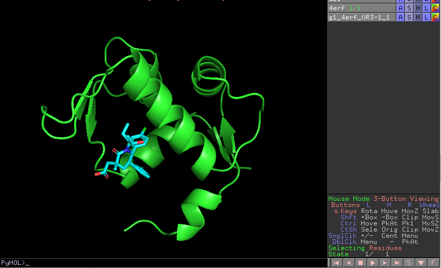

:orphan: true
.. _pwchem-extract-small-molecules:

###############################################################
Extract Small Molecules
###############################################################
This protocol extract the small molecules present in a ``AtomStruct`` object.

Input
----------------------------------------
.. include:: ../../../../templates/plugins/input-help.rst

.. image:: ../../../../../_static/images/plugins/pwchem/virtual-drug-screening/extract-small-molecules/form.png
   :alt: Extract Small Molecules form
   :height: 400
   :align: center

|

The result of this protocol is a ``SetOfSmallMolecules``, docked to the original protein structure, which can be cleaned.

|

.. |testCommand| replace:: pwchem.tests.tests_docking.TestExtractLigand
.. include:: ../../../../templates/plugins/protocol-test.rst
